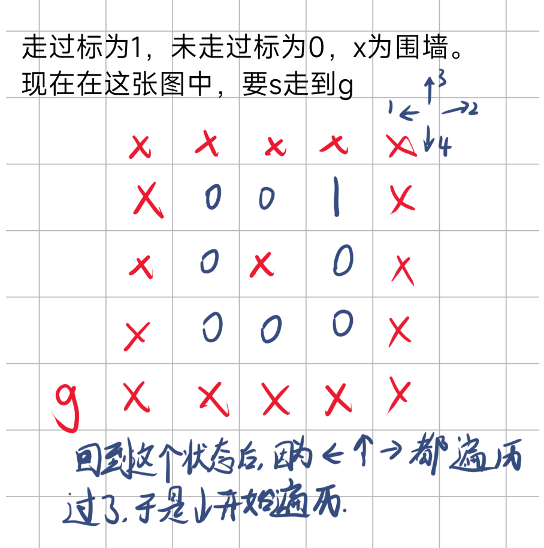
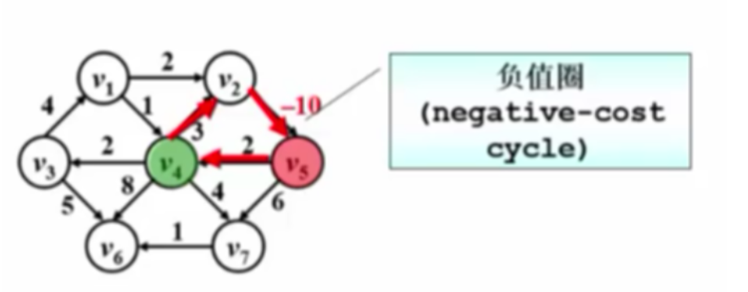

# 数据结构与算法 #

该笔记主要来自 *MOOC浙江大学数据结构课程*   [链接](https://www.icourse163.org/course/ZJU-93001?from=searchPage&outVendor=zw_mooc_pcssjg_),  结合CSDN等社区资源编写而成。

（可能会有一些细节错误，待校对）

## 线性结构

### 线性表

线性表（Linear List）:由同类型的数据元素构成有序序列的线性结构

- 表中元素个数称为线性表的长度
- 线性表没有元素时，称为空表
- 表起始位置称为表头，表结束位置称为表尾

#### 顺序存储实现

利用数组的连续存储空间顺序存放线性表的各元素

```c++
#define MaxSize 1000
typedef struct Lnode* PtrL;
struct Lnode
{
    int Data[MaxSize];
    int last;
};
struct Lnode L;
```

访问下标为$i$的元素：$L.Data[i]或PtrL->Data[i]$

线性表的长度：$L.last+1或PtrL->last+1$

```c++
//插入
void Insert(int x,int i,Lnode &L)
{
    if(L.last==MaxSize-1)
    {
        cout<<"FULL!"<<endl;
        return;
    }
    if(i<1||i>L.last+2)
    {
        cout<<"FALSE!"<<endl;
        return;
    }
    for(int j=L.last;j>=i-1;j--)
    {
        L.Data[j+1]=L.Data[j];
    }
    L.Data[i-1]=x;
    L.last++;
    return;
}
```

平均移动次数为$n/2$,平均时间复杂度为$O(n)$

```c++
//删除
void DeleteElem(int i,PtrL p)
{
    if(i<1||i>p->last+1)
    {
        cout<<"flase!"<<endl;
        return;
    }
    for(int j=i-1;j<p->last;j++)
    {
        p->Data[j]=p->Data[j+1];
    }
    p->last--;
    return;
}
```

平均移动次数为$(n-1)/2$,平均时间复杂度为$O(n)$

#### 链式存储实现


通过"链"建立起数据元素之间的逻辑关系

- 插入、删除不需要移动数据元素，只需要修改链

```c++
typedef struct LNode *List;
struct LNode
{
    int data;
    List Next;
};
struct LNode L;
List PtrL;
```

```c++
int Length(List PtrL)//求表长
{
    List temp = PtrL;
    int len = 0;
    while (temp != NULL)
    {
        temp = temp->Next;
        len++;
    }
    return len;
}
int FindElem(int i, List PtrL)//找元素
{
    List temp = PtrL;
    int n = 1;
    while (n < i && temp != NULL)
    {
        temp = temp->Next;
        n++;
    }
    if (n == i)
    {
        return temp->data;
    }
    else
    {
        return -1;
    }
}
List Insert(int x, int i, List PtrL)//插入
{
    List temp;
    if (i == 1)
    {
        temp = new LNode;
        temp->data = x;
        temp->Next = PtrL;
        return temp;
    }
    List p = PtrL;
    int j = 1;
    while (p && j < i - 1)
    {
        p = p->Next;
        j++;
    }
    if (j == i - 1)
    {
        temp = new LNode;
        temp->data = x;
        temp->Next = p->Next;
        p->Next=temp;
        return PtrL;
    }
    else
    {
        return NULL;
    }
}
List Delete(int i,List PtrL)//删除
{
    List p,s;
    if(i==1)
    {
        s=PtrL;
        if(PtrL!=NULL)
        {
            PtrL=PtrL->Next;
        }
        else
        {
            return NULL;
        }
        delete s;
        return PtrL;
    }
    int j = 1;
    while (p && j < i - 1)
    {
        p = p->Next;
        j++;
    }
    if(j!=i-1||p->Next==NULL)
    {
        cout<<"false"<<endl;
        return NULL;
    }
    else
    {
        s=p->Next;
        p->Next=s->Next;
        delete s;
        return PtrL;
    }
}
```


#### 广义表和多重链表

**广义表**

- 广义表时线性表的推广
- 对于线性表而言，n个元素都是基本的单元素
- 广义表中，这些元素不仅可以时单元素也可以时另一个广义表

**多重链表**

多重链表：链表中的节点可能同时隶属于多个链

- 多重链表中节点的指针域会有多个
- 包含两个指针域的链表并不一定时多重链表，比如双向链表不是多重链表
- 有广泛用途：树、图这样相对复杂的数据结构都可以采用多重链表方式实现存储

### 堆栈

#### 定义

堆栈（Stack）:具有一定操作约束的线性表

- 只在一端（栈顶，Top）做插入、删除 <br>
  - 插入数据：入栈（Push）
  - 删除数据：出栈（Pop）
  - 后入先出的规则

#### 顺序存储实现

栈的顺序存储结构通常由一个一维数组和一个记录栈顶元素位置的变量组成

```c++
#define MaxSize 1000
typedef struct SNode *Stack;
struct SNode
{
    int Data[MaxSize];
    int top;
};
void Push(Stack p,int elem)
{
    if(p->top==MaxSize-1)
    {
        cout<<"FULL!"<<endl;
        return;
    }
    else
    {
        p->Data[++(p->top)]=elem;
        return;
    }
}
int Pop(Stack p)
{
    if(p->top==-1)
    {
        cout<<"EMPTY!"<<endl;
        return -1;
    }
    else
    {
        return p->Data[(p->top)--];
    }
}
```

#### 链式存储实现

栈的链式存储结构实际上就是一个单链表，叫做链栈。插入和删除只能在链栈的栈顶进行。

```c++
typedef struct Snode *Stack;
struct Snode
{
    int data;
    struct Snode *Next;
};
Stack CreateStack()//堆栈的初始化
{
    Stack s;
    s=new Snode;
    s->Next=NULL;
    return s;
}
bool IsEmpty(Stack S)
{
    return (S->Next==NULL);
}
void Push(int elem ,Stack s)
{
    Stack temp=new Snode;
    temp->data=elem;
    temp->Next=s->Next;
    s->Next=temp;
}
int Pop(Stack s)
{
    Stack temp;int t;
    if(IsEmpty(s))
    {
        cout<<"EMPTY!"<<endl;
        return -1;
    }
    else
    {
        temp=s->Next;
        s->Next=temp->Next;
        t=temp->data;
        delete temp;
        return t;
    }
}
```

#### 标准库函数

在栈中应包含头文件: #include< stack >
定义: stack< int > s;

- s.empty();         //如果栈为空则返回true, 否则返回false;
- s.size();            //返回栈中元素的个数
- s.top();             //返回栈顶元素, 但不删除该元素
- s.pop();            //弹出栈顶元素, 但不返回其值
- s.push();          //将元素压入栈顶

### 队列

#### 定义

队列（Queue）：具有一定操作约束的线性表

- 插入和删除操作：只能在一端插入，在另一端删除 <br>
  - 数据插入：入队列
  - 数据删除：出队列
- 先进先出

#### 链表实现

```c++
//链表实现队列
#include<iostream>
using namespace std;
typedef struct Lnode *Lptr;
struct Lnode
{
	int data;
	Lptr next;
};
struct QueueLink
{
	Lptr front, rear;
};
QueueLink CreateNewQueue()
{
	QueueLink q;
	q.front=q.rear=NULL;
	return q;
}
bool IsEmpty(QueueLink q)
{
	if(q.front==NULL)
	{
		return true;
	}
	else
	{
		return false;
	}
}
void EnQueue(QueueLink &q,int elem)
{
	Lptr temp=new Lnode;
	if(q.front==NULL)
	{
		q.front=q.rear=new Lnode;
		q.rear->data=elem;
		q.rear->next=NULL;
	}
	else
	{
		temp->data=elem;
		temp->next=NULL;
		q.rear->next=temp;
		q.rear=temp;
	}
}

void DeQueue(QueueLink &q)
{
	if(IsEmpty(q))
	{
		cout<<"empty!"<<endl;
		return;
	}
	Lptr temp;
	temp=q.front;
	q.front=q.front->next;
	delete temp;
}
int Queuefront(QueueLink q)
{
	if(IsEmpty(q))
	{
		cout<<"Empty!"<<endl;
		return -1;
	}
	return q.front->data;
}
void DestoryQueue(QueueLink &q)
{
	if(!IsEmpty(q))
	{
		 while(q.front!=NULL)
		 {
		 	Lptr temp=q.front;
		 	q.front=q.front->next;
		 	delete temp;
		 }
	} 
}
int GetSize(QueueLink q)
{
	int size=0;
	while(q.front!=NULL)
	{
		size++;
		q.front=q.front->next;
	}
	return size;
}
int main()
{
	QueueLink q=CreateNewQueue();
	for(int i=1;i<=10;i++)
	{
		EnQueue(q,i+3);
	}
	cout<<GetSize(q)<<endl;
//	for(int i=1;i<=10;i++)
//	{
//		cout<<Queuefront(q)<<" ";
//		DeQueue(q);
//	}
    DestoryQueue(q);
	cout<<endl<<GetSize(q)<<endl;
	return 0; 
}
```

#### 顺序表实现

```c++
//顺序表实现
#include<iostream>
using namespace std;
#define MaxNum 1000
struct Queue
{
	int data[MaxNum];
	int front,rear;
};
Queue CreateNewQueue()
{
	Queue q;
	q.front=0;
	q.rear=-1;
	return q;
}
bool IsEmpty(Queue q)
{
	if(q.front>q.rear)
	{
		return true;
	}
	else
	{
		return false;
	}
}
void EnQueue(Queue &q,int elem)
{
	q.data[++q.rear]=elem;
}
void DeQueue(Queue &q)
{
	if(IsEmpty(q))
	{
		cout<<"Empty!"<<endl;
		return;
	}
	q.front++;
}
int Queuefront(Queue q)
{
	if(IsEmpty(q))
	{
		cout<<"Empty!"<<endl;
		return -1;
	}
	return q.data[q.front];
}
int GetSize(Queue q)
{
	return (q.rear-q.front+1);
}
int main()
{
	Queue q=CreateNewQueue();
	for(int i=1;i<=10;i++)
	{
		EnQueue(q,i+3);
	}
	cout<<GetSize(q)<<endl;
	for(int i=1;i<=10;i++)
	{
		cout<<Queuefront(q)<<" ";
		DeQueue(q);
	}
	cout<<endl<<GetSize(q)<<endl;
	return 0;
 } 
```

#### 标准库函数

1、库中queue的获取

队列和栈一样，存储在库中，可以通过#include<queue>获取

2、queue的定义

queue<T> q;其中T为int，char,float等等

可以通过自定义类型名，再调用定义

3、主要功能函数

- push(e):将元素e压入队列尾部

- pop():将队列首部元素弹出，无返回

- front():获取队列头部元素

- back():获取队列尾部元素

- empty():判断队列是否为空

- size():取得队列的大小

[原文链接](https://blog.csdn.net/u013069552/article/details/81211310)

## 树 ##

### 二叉树 ###

#### 二叉树的定义

1. 二叉树具有五种基本形态：

   

2. 特殊二叉树

   - 斜二叉树

     

   - 完美二叉树（满二叉树）

     

   - 完全二叉树

     不是完美二叉树，例如有n层的完全二叉树，前n-1层是满二叉树，但是第n层的右边相对于满二叉树可以缺一些叶节点

     

#### 二叉树的重要性质 ####

1. 一个二叉树第n层的最大节点数是：
   $$
   2^{i-1},i\geq1
   $$

2. 深度为n的二叉树有最大结点总数为：(满二叉树)
   $$
   2^n-1,n\geq1
   $$

3. 对于任何非空二叉树T，若n<sub>0</sub>表示叶结点的个数、n<sub>2</sub>是度为2的非叶结点的个数，那么两者满足关系式：n<sub>0</sub>=n<sub>2</sub>+1

   （简单证明：$n_0+n_1+n_2-1=0*n_0+1*n_1+2*n_2$​  利用边的数量列等式）

#### 二叉树的存储结构 ####

1. 顺序存储结构

   

   - 当根节点序号标为0时 <br>
     - 非根节点的父结点的序号为$[(i-1)/2]$​
     - 结点的左孩子结点的序号为$2i+1$
     - 结点的右孩子结点的序号为$2i+2$
   
   - 完全二叉树：按照从上到下·从左到右的顺序存储n个结点
   - 一般二叉树：也可以用这种结构，但是会造成空间浪费，缺的地方空补位
   
2. 链表存储

   ```c++
   typedef struct TreeNode *BinTree;
   typedef BinTree Position;
   struct TreeNode{
       ElementType Data;
       BinTree Left;
       BinTree Right;
   };
   ```

   

   先序创建二叉树

   ```c++
   void CreatBinTree(BinTree &BT)
   {
       char ch;
       cin>>ch;
       if(ch=='.'){
           BT=NULL;
           return;
       }
       else{
           BT=new TreeNode;
           BT->data=ch;
           CreateBinTree(BT->Left);
           CreateBinTree(BT->Right);
       }
   }
   ```

### 二叉树的遍历 ###

#### 先序遍历 ####

先访问根节点，再先序遍历其左子树，再先序遍历其右子树

```c++
void PreOrderTraversal(BinTree BT)
{
    if(BT){
        printf("%d",BT->Data);
        PreOrderTraversal(BT->Left);
        PreOrderTraversal(BT->Right);
    }
}
```

#### 中序遍历

先中序遍历其左子树，再访问根节点，再中序遍历其右子树

```c++
void InOrderTraversal(BinTree BT)
{
    if(BT){
        InOrderTraversal(BT->Left);
        printf("%d",BT->Data);
        InOrderTraversal(BT->Right);
    }
}
```

#### 后序遍历

先后序遍历其左子树，再后序遍历其右子树，再访问根结点

```c++
void PostOrderTraversal(BinTree BT)
{
    if(BT){
        PostOrderTraversal(BT->Left);
        PostOrderTraversal(BT->Right);
        printf("%d",BT->Data);
    }
}
```

#### 中序非递归遍历

中序遍历非递归遍历算法：使用堆栈

```c++
void InorderTraversal(BinTree BT)
{//感觉思路没错，但是运行时总是发生灵异事件
    BinTree T=BT;
    stack S=CreatStack(Maxsize);
    while(T||!IsEmpty(S)){
        while(T){
            Push(S,T);
            //如果为先序遍历，就在这printf
            T=T->Left;
        }
        if(!IsEmpty(S)){
            T=Pop(S);
            printf("%d",T->Data);//先序遍历，删掉这一行
            T=T->Right;
        }
    }
}
```

#### 层序遍历

层序遍历是树（特别是二叉树）遍历的一种方法，它按照层次从上到下、从左到右依次访问每个节点。层序遍历也称为广度优先遍历（BFS，Breadth-First Search），通常使用队列（Queue）来实现。

```c++
void LevelOrderTraversal(BinTree BT)
{
    Queue Q;   BinTree T;
    if(!BT){
        return;//如果是空树，返回
    }
    Q=CreatQueue(Maxsize);//创建并初始化队列
    AddQ(Q,BT);
    while(!IsEmptyQ(Q)){
        T=DeleteQ(Q);
        cout<<T->Data<<endl;
        if(T->Left){
            AddQ(Q,T->Left);
        }
        if(T->Right){
            AddQ(Q,T->Right);
        }
    }
}
```

#### 遍历二叉树应用

##### 输出二叉树中的叶子结点

```c++
void PreOrderPrintLeaves(BinTree BT)
{
    if(BT){
        if(!BT->Left&&!BT->Right){
            cout<<BT->Data<<endl;
        }
        PreOrderPrintLeaves(BT->Left);
        PreOrderPrintLeaves(BT->Right);
    }
}
```

##### 求二叉树高度

```c++
int PostOrderGetHeight(BinTree BT)
{
    int HL,HR,MaxH;
    if(BT){
        HL=PostOrderGetHeight(BT->Left);
        HR=PostOrderGetHeight(BT->Right);
        MaxH=max(HL,HR);
        return (MaxH+1);
    }
    else{
        return 0;
    }
}
```

##### 运算表达式


- 先序遍历得到前缀表达式：+ + a * b c * + * d e f g

- 中序遍历得到中序表达式：a + b * c + d * e + f * g  (中缀表达式会受运算符优先级的影响，需要加括号优化)

- 后序遍历得到后缀表达式：a b c * + d e * f + g * +

  ```c++
  void InOrderTraversalCal(BinTree BT,int d)
  {
      if(BT==NULL)
      {
          return;
      }
      else if(BT->Left==NULL&&BT->Right==NULL)
      {
          printf("%d",BT->Data);
      }
      else
      {
          if(d>1)
          {
              cout<<" ( ";
          }
          InOrderTraversalCal(BT->Left,d+1);
          printf("%d",BT->Data);
          InOrderTraversalCal(BT->Right,d+1);
          if(d>1)
          {
              cout<<" ) ";
          }
      }
  }
  ```

##### 根据中序遍历和先序遍历确定唯一的二叉树

也可以根据中序遍历和后序遍历确定唯一的二叉树，但是只根据先序和后序不行，因为先序是根左右，后序是左右根。例如先序为  a  b，后序为 b a，其可能是a为根，b为左，也可能是a为根，b为右。

[CSDN文章](http://t.csdnimg.cn/5FGQ8)

```c++
BinTree recreateBinTree(int pre[],int in[],int size)
{
    if(size<=0)
    {
        return NULL;
    }
    int i=0;
    while(i<size)
    {
       if(pre[0]==in[i])
       {
        break;
       }
        i++;
    }
    BinTree BT=new TreeNode;
    BT->Data=pre[0];
    BT->Left=recreateBinTree(pre+1,in,i);
    BT->Right=recreateBinTree(pre+i+1,in+i+1,size-i-1);
    return BT;
}
```

### 二叉查找树

#### 定义

非空左子树的所有键值小于其根结点的键值；非空右子树的所有键值大于其根结点的键值；左右子树都是二叉查找树。

别称： **二叉搜索树**  **二叉排序树**  **有序二叉树**  **排序二叉树**

#### 二叉搜索树的查找操作

1. 递归实现

   ```c++
   Position Find(ElementType X,BinTree BST)
   {
       if(!BST){
           retrun NULL;
       }
       if(X>BST->Data){
           Find(BST->Right);
       }
       else if(X<BST->Data){
           Find(BST->Left);
       }
       else{
           return BST;
       }
   }
   ```

2. 非递归实现

   ```c++
   Position IterFind(ElementType X,BinTree BST)
   {
       while(BST){
           if(X<BST->Data){
               BST=BST->Left;
           }
           else if(X>BST->Data){
               BST=BST->Right;
           }
           else{
               return BST;
           }
       }
       return NULL;
   }
   ```

3. 查找最大最小元素

   - 最大元素一定在树的最右分支的端结点上
   - 最小元素一定在树的最左分支的端结点上

   ```c++
   Position FindMin(BinTree BST)//查找最小元素，同理最大
   {
       if(!BST){
           return NULL;
       }
       while(BST->Left){
           BST=BST->Left;
       }
       return BST;
   }
   ```

#### 二叉搜索树的插入

1. 递归实现

```c++
BinTree Insert(ElementType X,BinTree BST)
{
    if(!BST){
        BST=new TreeNode;
        BST->Data=X;
        BST->Left=BST->Right=NULL;
    }
    else{
        if(X<BST->Data){
            BST->Left=Insert(X,BST->Left);
        }
        else if(X>BST->Data){
            BST->Right=Insert(X,BST->Right);
        }
    }
    return BST;
}
```

2. 非递归实现

   ```c++
   void DInsert(ElementType X,BinTree &BST)
   {
       while(BST){
           if(X>BST->Data){
               BST=BST->Right;
           }
           else if(X<BST->Data){
               BST=BST->Left;
           }   
       }
       if(!BST){
           BST=new TreeNode;
           BST->Data=X;
           BST->Left=BST->Right=NULL;
       }
   }
   ```

#### 二叉搜索树的删除操作

- 要删除的结点只有一个孩子结点：

  将其父节点的指针指向要删除结点的孩子结点

- 要删除的结点有左右两棵子树：

  用另一结点代替被删除结点：右子树的最小元素或者左子树的最大元素

1. 递归实现

```c++
BinTree Delete(ElementType X,BinTree BST)
{
    Position Tmp=new TreeNode;
    if(!BST){
        cout<<"未找到要删除元素"<<endl;
    }
    else if(X<BST->Data){
        BST->Left=Delete(X,BST->Left);
    }
    else if(X>BST->Data){
        BST->Right=Delete(X,BST->Right);
    }
    else{
        if(BST->Left&&BST->Right){//被删除结点有两个孩子
            Tmp=FindMin(BST->Right);//在右子树里找最小元素填充删除的结点
            BST->Data=Tmp->Data;
            BST->Right=Delete(Tmp->Data,BST->Right);//在删除结点的右子树中删除右子树的最小元素
        }
        else{//被删除结点有一个孩子，或者没有孩子
            Tmp=BST;
            if(!BST->Left){//有右孩子或者无子结点
                BST=BST->Right;
            }
            else if(!BST->Right){
                BST=BST->Left;
            }
        }
    }
    free(Tmp);
    return BST;
}
```

2. 非递归实现

```c++
bool DeleteBinTree(ElementType X,BinTree BST)
{
    BinTree parent=NULL;
    BinTree Tmp=new TreeNode;
    while(BST){
        if(X>BST->Data){
            parent=BST;
            BST=BST->Right;
        }
        else if(X>BST->Data){
            parent=BST;
            BST=BST->Left;
        }
        else{
            if(BST->Left&&BST->Right){
                Tmp=BST->Right;
                while(Tmp->Left){
                    Tmp=Tmp->Left;
                }
                BST->Data=Tmp->Data;
                DeleteBinTree(Tmp->Data,BST->Right);
            }
            else{
                if(!BST->Left){
                    if(parent==NULL){//要删除的是根节点
                        BST=BST->Right;
                    }
                    else{//要删除的不是根节点
                        if(BST=parent->Right){
                            parent->Right=BST->Right;
                        }
                        else{
                            parent->Left=BST->Right;
                        }
                    } 
                }
                else if(!BST->Right){
                    if(parent==NULL){//要删除的是根节点
                        BST=BST->Left;
                    }
                    else{//要删除的不是根节点
                        if(BST=parent->Right){
                            parent->Right=BST->Left;
                        }
                        else{
                            parent->Left=BST->Left;
                        }
                    } 
                }
            }
            free(Tmp);
            return 1;
        }
    }
    free(Tmp);
    return 0;    
}
```

   

3. 截枝方法实现删除操作
   把删除结点的左子树挂到右子树的最小元素后面成为它的左子树，或者把删除结点的右子树挂到左子树的最大元素的后面成为它的右子树。截枝方法可能会大幅改变树的形状，影响查找速度

#### 二叉搜索树判断是否相同

```c++
typedef struct TreeNode *Tree;
struct TreeNode{
    int v;
    Tree Left,Right;
    int flag;
}
Tree MakeTree(int N)
{//根据已给序列创建一个总结点数为N的二叉搜索树
    Tree T;
    int i,V;
    cin>>V;
    T=NewNode(V);
    for(i=1;i<N;i++){
        cin>>V;
        T=Insert(T,V);
    }
    return T;
}
Tree Insert(Tree T,int V)
{
    if(!T){
        T=NewNode(V);
    }
    else{
        if(V>T->v){
            T->Right=Insert(T->Right,V);
        }
        else{
            T->Left=Insert(T->Left,V);
        }
    }
    return T;
}
Tree NewNode(int V)
{
    Tree T=new TreeNode;
    T->v=V;
    T->Left=T->Right=NULL;
    T->flag=0;
   return T;
}
bool check(Tree T,int V)
{
    if(T->flag){
        if(V<T->v){
            return check(T->Left,V);
        }
        else if(V>T->v){
            return check(T->Right,V);
        }
        else return 0;//说明元素重复，错误
    }
    else{
        if(V==T->v){
            T->flag=1;
            return 1;
        }
        else{
            return 0;//说明T->flag=0,并且T->v不等于V,所以搜索树不相同，错误
        }
    }
}
void ResetT(Tree T)
{
    if(T->Left){
        ResetT(T->Left);
    }
    if(T->Right){
        ResetT(T->Right);
    }
    T->flag=0;
}
void FreeTree(Tree T)
{
    if(T->Left){
        FreeTree(T->Left);
    }
    if(T->Right){
        FreeTree(T->Right);
    }
    free(T);
}
int Judge(Tree T,int N)
{//判断已经建立的树和根据新的输入序列建的树是否相同
    int i,V,Flag=0;//Flag用于判断当前两棵树是否一致
    cin>>V;
    if(V!=T->v){
        Flag=1;//根节点元素就不一样了，当前树不一致，Flag为1
    }
    else{
        T->flag=1;//这里的flag=1表示，对于该节点已确认一致
    }
    for(i=1;i<N;i++){//根节点已经判断过，所以从i=1开始循环N-1次
        cin>>V;
        if((!Flag)&&(!check(T,V))){
            //当前根节点一致，对子树进行check判断是否一致
            //如果不一致，即树不相同，Flag=1；
            Flag=1;
        }
    }
    if(Flag){
        return 0;
    }
    else return 1;
}
  
int main()
{
    int N,L;//N为二叉搜索树的结点个数，L是待判断的输入序列
    Tree T;
    cin>>N;
    while(N){
        cin>>L;
        T=MakeTree(N);
        for(int i=0;i<L;i++){
            if(Judge(T,N)){
                cout<<"Yes"<<endl;
            }
            else{
                cout<<"No"<<endl;
            }
            ResetT(T);//清除T中各点的flag标记，便于下一输入序列的判断
        }
        FreeTree(T);//释放T的空间
        cin>>N;
    }
    return 0;
}
```


### 平衡二叉树

#### 定义

（AVL树）空树，或者任一结点左右子树高度差的绝对值不超过1，即|BF(T)|$\leq$1

其中BF 平衡因子：BF(T)=$h_{L}-h_{R}$，其中$h_{L}$和$h_{R}$分别是T的左子树和右子树的高度

####  平衡二叉树的旋转

[图文详解](https://zhuanlan.zhihu.com/p/438604092)

### 堆(heap) ###

#### 堆的特性

1. 结构性：用数组表示的完全二叉树；

2. 有序性：任意结点的关键字是其子树所有节点的最大值（或最小值）

   最大堆（MaxHeap）,也称“大顶堆”：最大值

   最小堆（MinHeap）,也称“小顶堆”：最小值
   
   也有称呼：最大二叉堆和最小二叉堆


#### 最大堆的操作

[图文详解](http://t.csdnimg.cn/lXnj0)

##### 最大堆的创建

```c++
typedef struct HeapStruct *MaxHeap;
struct HeapStruct
{
    ElementType *Elements;//储存堆元素的数组
    int Size;//当前堆的元素个数
    int Capacity;//堆的最大容量
};
MaxHeap Create(int MaxSize)
{//创建容量为MaxSize的空的最大堆
    MaxHeap H=new HeapStruct;
    H->Elements=new ElementType[MaxSize+1];
    H->Size=0;
    H->Capacity=MaxSize;
    H->Elements[0]=MaxData;//定义“哨兵”为亚于堆中所有元素可能的值，便于后续操作
    return H;
}
```

##### 最大堆的插入

```c++
void Insert(MaxHeap H,ElementType item)
{//此插入操作默认H->Elements[0]已经被定义为哨兵
    if(H->Size==H->Capacity)
    {
        cout<<"The heap is full!"<<endl;
        return;
    }
    int i=++H->Size;
    while(H->Elements[i/2]<item)
    {//因为有哨兵存在，所以到H->Elements[1/2]时，一定会跳出循环
    //假如没有事先定义哨兵，则while判断条件为(H->Elements[i/2]<item&&i>1)
        H->Elements[i]=H->Elements[i/2];
        i/=2;
    }
    H->Elements[i]=item;
    //时间复杂度O(log N )
}
```

##### 最大堆的删除

```c++
ElementType DeleteMax(MaxHeap H)
{//从最大堆中取出键值最大的元素，并删除该节点
    int Parent,Child;
    int MaxItem,temp;
    if(H->Size==0)
    {
        cout<<"The heap is empty!"<<endl;
        return -1;
    }
    MaxItem=H->Elements[1];//取出根节点最大值
    Parent=1;
    //H->Elements[1]=H->Elements[H->Size--];
    // while(Parent*2<=H->Size)
    // {
    //     Child=Parent*2;
    //     if(Child+1<=H->Size)//判断是否有右孩子
    //     {
    //         if(H->Elements[Child+1]>H->Elements[Child])
    //         {
    //             Child=Child+1;
    //         }
    //     }
    //     if(H->Elements[Parent]<H->Elements[Child])
    //     {
    //         temp=H->Elements[Parent];
    //         H->Elements[Parent]=H->Elements[Child];
    //         H->Elements[Child]=temp;
    //         Parent=Child;
    //     }
    //     else
    //     {
    //         break;
    //     }
    // }
    temp=H->Elements[H->Size--];//优化后的循环
    while(Parent*2<=H->Size)
    {
        Child=Parent*2;
        if(Child!=H->Size&&H->Elements[Child+1]>H->Elements[Child])
        {
            Child++;
        }
        if(temp>=H->Elements[Child])
        {//因为一直是拿temp作比较，所以在遍历过程中没必要改变temp的值
            break;
        }
        else
        {
            H->Elements[Parent]=H->Elements[Child];
            //孩子把父节点的值覆盖掉，因为根节点的值已经通过temp保存下来，所以没有数据丢失
            Parent=Child;
        }
    }
    H->Elements[Parent]=temp;
    return MaxItem;
}
```

##### 最大堆的建立

```c++
void CreateUnorderedQueue(MaxHeap H,int n)
{//构建一个无序队列
    for(int i=1;i<=n;i++)
    {
        int x;cin>>x;
        H->Elements[i]=x;
        H->Size++;
    }
    cout<<"END-----END"<<endl;
}
void CreateMaxHeap(MaxHeap H)
{//延删除操作的思想，在此操作之前要先构建一个无序队列
    int i=(H->Size)/2;
    for(i;i>=1;i--)
    {
        int Parent,Child,temp;
        Parent=i;
        temp=H->Elements[Parent];
        while(Parent*2<=H->Size)
        {
            Child=Parent*2;
            if(Child<H->Size&&H->Elements[Child]<H->Elements[Child+1])
            {
                Child++;
            }
            if(temp>=H->Elements[Child])
            {
                break;
            }
            else
            {
                H->Elements[Parent]=H->Elements[Child];
                Parent=Child;
            }
        }
        H->Elements[Parent]=temp;
    }
}
```

### 哈夫曼树

#### 定义

带权路径长度（WPL）：设二叉树有n个叶子结点，每个叶子结点带有权值$x_k$，从根结点到每个叶子结点的长度为$l_k$，则每个叶子结点的带权路径长度之和就是：$WPL=\sum_{k=1}^{n}{w_kl_k}$

最优二叉树或哈夫曼树：WPL最小的二叉树

#### 哈夫曼树的构造

1. **统计字符频率**：首先，统计需要编码的字符在待压缩的数据中出现的频率。这个频率信息将用来构建哈夫曼树的基础。

2. **创建叶子节点**：为每个字符创建一个叶子节点，并将频率信息（权重）赋给每个叶子节点。

3. **构建哈夫曼树**：从所有叶子节点开始，反复合并权重最小的两个节点，直到所有节点都被合并为一个根节点。合并的过程是按照节点的权重进行的，每次合并都会生成一个新的父节点，其权重为被合并的两个节点的权重之和。这个过程可以通过最小堆来实现，以保证每次合并最小的两个节点。

4. **确定编码**：从根节点开始，向左走的路径标记为0，向右走的路径标记为1。沿着从根节点到叶子节点的路径，记录每个字符的编码。由于哈夫曼树是一棵前缀树，即没有任何一个字符的编码是另一个字符编码的前缀，因此可以保证编码的唯一性和无歧义性。

5. **生成编码表**：将每个字符及其对应的编码记录在一个编码表中，以便于编码和解码过程中的转换。

[动画演示：哈夫曼树的生成]( https://www.bilibili.com/video/BV1fu4y1o7fD/?share_source=copy_web&vd_source=b9320bc3752a1eab5dea18bba34bccd2)

哈夫曼树构造的代码实现，利用最小堆，附带最小堆的相关代码

```c++
 #include<iostream>
 using namespace std;
#define MinData -99999999

typedef struct HuffmanTreeNode *HuffmanTree;
struct HuffmanTreeNode//链式存储
{
    int weight;
    HuffmanTree Left ,Right;
};


typedef struct HeapStruct *MinHeap;//顺序存储
struct HeapStruct
{
    HuffmanTree *Data;
    int size;
    int capacity;
};

HuffmanTree NewHuffmanNode()
{
    HuffmanTree T=new HuffmanTreeNode;
    T->weight=0;
    T->Left=T->Right=NULL;
    return T;
}
MinHeap Create(int MaxSize)
{
    MinHeap H=new HeapStruct;
    H->Data=new HuffmanTree[MaxSize+1];
    H->size=0;
    H->capacity=MaxSize;
    HuffmanTree T=NewHuffmanNode();
    T->weight=MinData;
    H->Data[0]=T;//哨兵
    return H;
}
void Insert(MinHeap H,HuffmanTree T)
{
    if(H->size==H->capacity)
    {
        cout<<"The MinHeap is Full!"<<endl;
        return;
    }
    int i=++H->size;
    while(H->Data[i/2]->weight > T->weight)
    {
        H->Data[i]=H->Data[i/2];
        i/=2;
    }
    H->Data[i]=T;
}
HuffmanTree DeleteMin(MinHeap H)
{
    int parent,child;
    HuffmanTree MinItem;
    if(H->size==0)
    {
        cout<<"The MinHeap is Empty!"<<endl;
        return NULL;
    }
    MinItem=H->Data[1];
    parent=1;
    HuffmanTree temp;
    temp=H->Data[H->size--];
    while(parent*2<=H->size)
    {
        child=parent*2;
        if(child!=H->size&&(H->Data[child+1]->weight<H->Data[child]->weight))
        {
            child+=1;
        }
        if(temp->weight>H->Data[child]->weight)
        {
            H->Data[parent]=H->Data[child];
            parent=child;
        }
        else
        {
            break;
        }
    }
    H->Data[parent]=temp;
    return MinItem;
}
void CreateMinHeap(MinHeap H)
{
    int i=(H->size/2);
    for(i;i>=1;i--)
    {
        int parent,child,temp;
        parent=i;
        while(parent*2<=H->size)
        {
            child=parent*2;
            if(child!=H->size&&H->Data[child+1]->weight<H->Data[child]->weight)
            {
                child++;
            }
            if(H->Data[parent]->weight>H->Data[child]->weight)
            {
                int temp=H->Data[parent]->weight;
                H->Data[parent]->weight=H->Data[child]->weight;
                H->Data[child]->weight=temp;
                parent=child;
            }
            else
            {
                break;
            }
        }
    }
}
void CreateUnorderedQueue(MinHeap H,int n)
{
    if(n>H->capacity)
    {
        cout<<"Exceed capacity!"<<endl;
        return;
    }
    for(int i=1;i<=n;i++)
    {
        int x;cin>>x;
        HuffmanTree T=NewHuffmanNode();
        T->weight=x;
        H->Data[i]=T;
        H->size++;
    }
}


HuffmanTree CreateHuffmanTree(MinHeap H)
{
    CreateMinHeap(H);//首先创建最小堆；(输进来的H是未经处理的队列)
    HuffmanTree HufTree;
    int num=H->size;
    for(int i=1;i<=num-1;i++)
    {
        HufTree=NewHuffmanNode();//每次循环建立一个新结点；
        HufTree->Left=DeleteMin(H);
        HufTree->Right=DeleteMin(H);
        HufTree->weight=HufTree->Left->weight+HufTree->Right->weight;
        Insert(H,HufTree);//插入的是一个树的分支        
    }
    HufTree=DeleteMin(H);
    return HufTree;
}

void PreOrderTraversal(HuffmanTree T)
{
    if(T)
    {
        cout<<T->weight<<endl;
        PreOrderTraversal(T->Left);
        PreOrderTraversal(T->Right);
    }
    else
    {
        cout<<"*"<<endl;
    }
}
 int main()
 {
    MinHeap h;
    h=Create(100);
    cout<<"plz enter n:"<<endl;int n;cin>>n;
    //测试样例：   10  5 2 8 6 4 3 7 1 9 10
    CreateUnorderedQueue(h,n);
    HuffmanTree T;
    T=CreateHuffmanTree(h);
    cout<<"********************"<<endl;
    PreOrderTraversal(T);

    system("pause");
    return 0;
 }
```

#### 哈夫曼树的特点

- 没有度为1的结点

- n个叶子结点的哈夫曼树共有2n-1个结点

  $n_0$：叶结点总数

  $n_1$：只有一个儿子的结点总数

  $n_2$：有两个儿子结点总数

  $n_2=n_0-1$

- 哈夫曼树的任意非叶结点的左右子树交换后仍是哈夫曼树

-  对于同一组权值{${w_1,w_2,……,w_n}$}，存在不同构的两棵哈夫曼树

  

#### 哈夫曼编码

[哈夫曼编码详解——图解秒懂](http://t.csdnimg.cn/BVBNk)

```c++
//与上面基本上没什么区别，主要多了一个HuffmanCode函数实现哈夫曼编码
typedef struct HuffmanTreeNode *HuffmanTree;
struct HuffmanTreeNode//#修改过
{
    char ch;//多了一个变量，存所要进行编码的字符
    int weight;
    HuffmanTree Left ,Right;
};
HuffmanTree NewHuffmanNode()//#修改过
{
    HuffmanTree T=new HuffmanTreeNode;
    T->ch='0';
    T->weight=0;
    T->Left=T->Right=NULL;
    return T;
}
void CreateUnorderedQueue(MinHeap H,int n)//#修改过
{
    if(n>H->capacity)
    {
        cout<<"Exceed capacity!"<<endl;
        return;
    }
    for(int i=1;i<=n;i++)
    {
        int x;char Ch;
        cin>>Ch>>x;
        HuffmanTree T=NewHuffmanNode();
        T->ch=Ch;
        T->weight=x;
        H->Data[i]=T;
        H->size++;
    }
}
void HuffmanCode(HuffmanTree T,int depth)
{
    static int code[100];
    if((T->Left==NULL)&&(T->Right==NULL))//叶子结点
    {
        cout<<T->ch<<" : ";
        for(int i=1;i<depth;i++)
        {
            cout<<code[i];
        }
        cout<<"  weight: "<<T->weight<<endl;
    }
    else
    {
        code[depth]=0;
        HuffmanCode(T->Left,depth+1);
        code[depth]=1;
        HuffmanCode(T->Right,depth+1);
    }
}
 //哈夫曼编码测试样例: 10 a 5 b 2 c 8 d 6 e 4 f 3 g 7 h 1 i 9 j 10
```

#### 哈夫曼编码解码（待补）


### 集合

可以用树的结构来表示集合，树的每个结点代表一个集合元素


双亲表示法：孩子指向双亲

#### 集合的查找

**查找数据所在的集合根节点**：

- `int Find(SetType_p p, int x)`：在集合中查找数据值 `x` 的根节点。
- 遍历数组，找到数据值为 `x` 的元素。
- 如果找到数据值 `x`，则通过父节点索引找到集合的根节点。
- 如果未找到数据值 `x`，输出 "Find None!" 并返回 `false`。

```c++
#define Size 100
typedef struct SetType *SetType_p;
struct SetType
{
    int Data;
    int parent;
};
SetType_p CreateSet(int n)
{
    SetType_p p=new SetType[Size];
    for(int i=0;i<n;i++)
    {
        int x;cin>>x;
        p[i].Data=x;
        int par;cin>>par;
        p[i].parent=par;
    }
    return p;
}
//集合的查找
int Find(SetType_p p,int x)
{
    int i=0;
    for(i;i<Size&&p[i].Data!=x;i++);
    if(i>=Size)
    {
        cout<<"Find None!"<<endl;
        return false;
    }
    for(;p[i].parent>=0;i=p[i].parent);
    return i;
}
/////////////////////////简化版本
#define MaxSize 1000
int SetType[MaxSize];
//让数组的序号作为集合元素，数组所存的数据即为各个元素父节点
int Find(int S[],int x)
{
    for(;S[x]>=0;x=S[x]);
    return x;
}
//进一步优化时间复杂度
//路径压缩
int Find2(int *s,int x)
{
    if(s[x]<0)//根节点
    {
        return x;
    }
    else
    {
        return s[x]=Find2(s,s[x]);
    }
}
```


#### 集合的并运算

```c++
void Union(SetType_p p,int x1,int x2)
{
    int root1,root2;
    root1=Find(p,x1);
    root2=Find(p,x2);
    if(root1!=root2)
    {
        p[root2].parent=root1;
    }
}
/////////////优化    //按秩归并
//按高度归并
void UnionSet(int *s,int root1,int root2)
{//让s[root]= -树高
    if(s[root1]<s[root2])//即root1的树高度大于root2的树高
    {
        s[root2]=root1;
    }
    else
    {
        if(s[root1]==s[root2])
        {
            //两棵树高度相等，合并后树高一定加1
            s[root2]--;
        }
        s[root1]=root2;
    }
}
//按规模归并
void UnionSet2(int *s,int root1,int root2)
{
    if(s[root1]<s[root2])//root1的规模更大
    {
        s[root1]+=s[root2];
        s[root2]=root1;
    }
    else
    {
        s[root2]+=s[root1];
        s[root1]=root2;
    }
}
```

## 图

### 图的概念

#### 图的构成

- 表示“多对多”的关系
- 包含                 $G(V,E)$
  - 一组顶点：通常用$V(Vertex)$​表示顶点集合
  - 一组边：通常用$E(Edge)$表示边的集合
    - 边是顶点对：$(v,w)\in E$，其中$v,w\in V$
    - 有向边<v,w>表示从v指向w的边（单行线）
    - 不考虑重边和自回路（与离散数学里面有所区别）

#### 相关名词

##### 连通

如果从v到w存在一条（无向）路径，则称v和w是连通的

##### 路径

v到w的路径是一系列顶点{${V,v_1,v_2,……,v_n,W}$}的集合，其中任一对相邻的顶点间都有图中的边。路径的长度是路径中的边数（如果带权，则是所有边的权重和）。如果v到w之间所有顶点都不同，则称简单路径

##### 回路

起点等于终点的路径

##### 连通图

图中任意两顶点均连通

##### 连通分量

无向图的极大连通子图，具有极大顶点数，如果再加一个顶点就不连通了；具有极大边数，包含子图中所有顶点相连的所有边。连通图只有一个极大连通子图，即其本身。

##### 极小连通子图

一个连通图的生成树是该连通图顶点集确定的极小连通子图。（同一个连通图可以有不同的生成树，所以生成树不是唯一的）

##### 强连通图

有向图中任意两顶点之间都存在双向路径

##### 强连通分量

有向图的极大强连通子图

### 图的表示法

#### 邻接矩阵

##### 定义

邻接矩阵$G[N][N]$，N个顶点从0到N-1编号
$$
G[i][j]=\begin{cases}
1 &&若<v_i,v_j>是G中的边\\
0 &&否则
\end{cases}
$$

##### 无向图的邻接矩阵

- 对于无向图，邻接矩阵是对称矩阵

无向图的邻接矩阵因为对称会造成空间的浪费，因此可以用一个长度为$N(N+1)/2$的1维数组来存储。


##### 邻接矩阵优缺点

优点

- 直观、简单、好理解

- 方便检查任以对顶点间是否存在边

- 方便找任一顶点的所有“邻接点”

- 方便计算任一顶点的“度”（从该点出发的边数为“出度”，指向该点的边数为“入度”）

  - 无向图：对应行（或列）非零元素的个数
  - 有向图：对应行非零元素的个数是出度；对于列非零元素的个数是入度


缺点

- 浪费空间，存稀疏图（点很多边少）有大量无效元素（稠密图，特别是完全图例外）
- 浪费时间

##### 邻接矩阵表示图

```c++
#include<iostream>
using namespace std;
#define MaxVertexNum 1000
typedef int ElementType;
//typedef string DataType;
typedef struct GNode *PtrToGNode;
struct GNode
{
    int Nv;//顶点数
    int Ne;//边数
    ElementType G[MaxVertexNum][MaxVertexNum];
    //DataType Data[MaxVertexNum];//存顶点的数据
};
typedef PtrToGNode MGraph;

typedef struct ENode *PtrToENode;
struct ENode
{
    int V1,V2;//有向边<v1,v2>
    int weight;//边的权重
};
typedef PtrToENode Edge;

MGraph CreateGraph(int VertexNum)//邻接矩阵的初始化
{
    int i,j;
    MGraph Graph=new GNode;
    Graph->Nv=VertexNum;
    Graph->Ne=0;
    for(i=0;i<Graph->Nv;i++)//初始化邻接矩阵，只存在顶点，没有边
    {
        for(j=0;j<Graph->Nv;j++)
        {
            Graph->G[i][j]=0;
        }
    }
    return Graph;
}
void InsertEdge(MGraph Graph,Edge E)
{
    Graph->G[E->V1][E->V2]=E->weight;
    Graph->G[E->V2][E->V1]=E->weight;//无向图需要，有向图省略
}

MGraph BuildGraph()
{
    MGraph Graph;
    Edge E;
    int VertexNum;cin>>VertexNum;//输入顶点数
    Graph=CreateGraph(VertexNum);//初始化图
    cin>>Graph->Ne;//输入边数
    if(Graph->Ne!=0)
    {
        E=new ENode;
        for(int i=0;i<Graph->Ne;i++)
        {
            cin>>E->V1>>E->V2>>E->weight;
            InsertEdge(Graph,E);
        }
    }
    //如果顶点带有数据
    // for(int i=0;i<Graph->Nv;i++)
    // {
    //     cin>>Graph->Data[i];
    // }
    return Graph;
}

int main()
{

    system("pause");
    return 0;
}

//简洁版
int G[MaxVertexNum][MaxVertexNum],Nv,Ne;
void BuildGraph_Concise()
{
    cin>>Nv>>Ne;
    for(int i=0;i<Nv;i++)//初始化
    {
        for(int j=0;j<Nv;j++)
        {
            G[i][j]=0;
        }
    }
    for(int i=0;i<Ne;i++)//插入边
    {
        int v1,v2,weight;
        cin>>v1>>v2>>weight;
        G[v1][v2]=weight;
        G[v2][v1]=weight;
    }
}

```


#### 邻接表

##### 定义

图在比较稀疏的情况下，用邻接表合算


- 方便找任一顶点的所有邻接点
- 节约稀疏图的空间
- 对于无向图，方便计算任一顶点的度，但是对于有向图，只能计算出度，入度需要构建逆邻接表（存指向自己的边）
- 并不方便检查任一对顶点间是否存在边

##### 邻接表表示图

```c++
#include<iostream>
using namespace std;
#define MaxVertexNum 1000
typedef struct AdjVNode*PtrToAdjVNode;//指向邻接点的指针
struct AdjVNode//定义邻接点的结构体
{
    int AdjV;//邻接点的下标
    int weight;//由上一个点指向这个邻接点的边的权重
    PtrToAdjVNode Next;//指向下一个邻接点的指针
};
typedef struct VNode//定义顶点的结构体
{
    PtrToAdjVNode FirstAdjVnode;
    //DataType Data;//存顶点的数据
}AdjList[MaxVertexNum];//顶点结构体数组
typedef struct GNode*PtrToGNode;
struct GNode//定义邻接表结构体
{
    int Nv;
    int Ne;
    AdjList G;//顶点序列（数组）
};
typedef PtrToGNode LGraph;//定义指向邻接表结构体的指针
typedef struct ENode *PtrToENode;
struct ENode
{
    int V1,V2;//有向边<v1,v2>
    int weight;//边的权重
};
typedef PtrToENode Edge;

LGraph CreateGraph(int VertexNum)//初始化邻接表
{
    LGraph Graph=new GNode;
    Graph->Nv=VertexNum;
    Graph->Ne=0;
    for(int i=0;i<Graph->Nv;i++)
    {
        Graph->G[i].FirstAdjVnode=NULL;
        //初始化每个顶点，无边，所以邻接点为空
    }
    return Graph;
}

void InsertEdge(LGraph Graph,Edge E)
{
    PtrToAdjVNode TempAdjVNode=new AdjVNode;
    TempAdjVNode->AdjV=E->V2;
    TempAdjVNode->weight=E->weight;
    TempAdjVNode->Next=Graph->G[E->V1].FirstAdjVnode;
    Graph->G[E->V1].FirstAdjVnode=TempAdjVNode;

    //如果是无向图，还需要插入边<v2,v1>
    PtrToAdjVNode TempAdjVNode2=new AdjVNode;
    TempAdjVNode2->AdjV=E->V1;
    TempAdjVNode2->weight=E->weight;
    TempAdjVNode2->Next=Graph->G[E->V2].FirstAdjVnode;
    Graph->G[E->V2].FirstAdjVnode=TempAdjVNode2;
}

LGraph BuildGraph()
{
    LGraph Graph;
    int VertexNum;cin>>VertexNum;
    Graph=CreateGraph(VertexNum);
    cin>>Graph->Ne;
    if(Graph->Ne!=0)
    {
        Edge E=new ENode;
        for(int i=0;i<Graph->Ne;i++)
        {
            cin>>E->V1>>E->V2>>E->weight;
            InsertEdge(Graph,E);
        }
    }
    //如果顶点带有数据
    // for(int i=0;i<Graph->Nv;i++)
    // {
    //     cin>>Graph->G[i].Data;
    // }
    return Graph;
}
int main()
{
    LGraph graph;
    graph=BuildGraph();

    system("pause");
    return 0;
}
//简洁版
typedef struct VertexNode* Ptr;
struct VertexNode
{
    int V;//顶点下标
    int weight;//由上一点指向这一点的边的权重
    Ptr Next;//指向下一节点
}AList[MaxVertexNum];
int Nv,Ne;
void Buildgraph()
{
    cin>>Nv;
    for(int i=0;i<Nv;i++)
    {
        AList[i].V=i;
        AList[i].Next=NULL;
        AList[i].weight=0;
    }
    int v1,v2,weight;cin>>Ne;
    for(int i=0;i<Ne;i++)
    {
        cin>>v1>>v2>>weight;
        Ptr temp=new VertexNode;
        temp->V=v2;
        temp->weight=weight;
        temp->Next=AList[v1].Next;
        AList[v1].Next=temp;
        //无向图还要插入<v2,v1>
    }
}
```


### 图的遍历

#### 深度优先搜索（DFS）

DFS是一种基于栈的遍历算法，其基本思想是沿着一个分支一直深入到底，再回溯到上一个节点，继续沿下一个分支深入。DFS适用于搜索所有可能的路径，并常用于解决如迷宫问题、连通性问题等。

**主要步骤**：

1. **初始化**：选择一个起始节点并标记为已访问，初始化栈（或使用递归）存储节点。
2. **访问节点**：将起始节点压入栈。
3. **循环**：
   - 从栈顶取出一个节点，访问该节点。
   - 将该节点的所有未访问的邻居节点压入栈，并标记为已访问。
   - 重复此过程直到栈为空。

##### [深さ優先探索]((https://www.luogu.com.cn/problem/AT_dfs_a))

题面翻译

高桥先生住的小区是长方形的，被划分成一个个格子。高桥先生想从家里去鱼店，高桥先生每次可以走到他前后左右四个格子中的其中一个，但不能斜着走，也不能走出小区。

现在给出地图：

```s```：代表高桥先生的家

```g```：代表鱼店

```.```：代表道路

```#```：代表墙壁

高桥先生不能穿过墙壁。

输入：第一行输入 $n(1\le n\le500)$，$m(1\le m\le500)$ 代表小区的长和宽，接下来 $n$ 行每行 $m$ 个字符，描述小区中的每个格子。

输出：如果高桥先生能到达鱼店，输出 ```Yes```，否则输出 ```No```。

样例 #1

样例输入 #1

```
4 5
s####
....#
#####
#...g
```

样例输出 #1

```
No
```

样例 #2

样例输入 #2

```
4 4
...s
....
....
.g..
```

样例输出 #2

```
Yes
```

样例 #3

样例输入 #3

```
10 10
s.........
#########.
#.......#.
#..####.#.
##....#.#.
#####.#.#.
g.#.#.#.#.
#.#.#.#.#.
###.#.#.#.
#.....#...
```

样例输出 #3

```
No
```

样例 #4

样例输入 #4

```
10 10
s.........
#########.
#.......#.
#..####.#.
##....#.#.
#####.#.#.
g.#.#.#.#.
#.#.#.#.#.
#.#.#.#.#.
#.....#...
```

样例输出 #4

```
Yes
```

样例 #5

样例输入 #5

```
1 10
s..####..g
```

样例输出 #5

```
No
```

###### 题解

```c++
#include<iostream>
#include<string.h>
using namespace std;
char map[505][505];
int f[505][505];
int n,m,flag=0;
int dx[4]={0,0,-1,1},dy[4]={-1,1,0,0};
void DFS(int x,int y)
{
    if(flag==1||map[x][y]=='#')
    {
        return;
    }
    if(map[x][y]=='g')
    {
        flag=1;
        return;
    }
    for(int i=0;i<4;i++)
    {
        if(f[x+dx[i]][y+dy[i]]==0)
        {
            f[x][y]=1;
            DFS(x+dx[i],y+dy[i]);
            // f[x][y]=0;
            //这里不能将状态回归！！！！
            //因为这里只需要探求能不能到达某一点，所以经过的路没有必要在走一遍
            //如果在这种情形下回溯，会导致重复走已经走过的路，虽然对最终结果没有影响
            //但是会导致时间成本增加，TLE
            //而回溯一般是要求对于一张图总共总共有多少条路能到达某一点
            //详细见下图
        }        
    }
}
int main()
{
    memset(map,'#',sizeof(map));
    cin>>n>>m;
    int sx,sy;
    for(int i=1;i<=n;i++)
    {
        for(int j=1;j<=m;j++)
        {
            cin>>map[i][j];
            if(map[i][j]=='s')
            {
                sx=i;sy=j;
            }
        }
    }
    DFS(sx,sy);
    if(flag==1)
    {
        cout<<"Yes"<<endl;
    }
    else
    {
        cout<<"No"<<endl;
    }
    system("pause");
    return 0;
}
```




回到这个状态后，由于初始点左边已经走完，右边和上边又不能走，于是开始走下边


于是DFS+回溯结束

下面是对于无回溯的情况


起始点左边走完后，右边上边下边都不能走，于是结束DFS。


从上面图中，可以看出DFS+回溯，与不加回溯的不同，虽然回溯对最终结果没有影响，但是会多走一些已经走过的路。而无回溯时，走过的路都会被标记，且不会被改回，所以在上述途中，走了一遍就退回了。综上可知，回溯的添加会使时间成本增加，可能会TLE，且对于这种求解情况无益。所以不要加回溯改回 f [ i ] [ j ] = 0;


#### 广度优先搜索（BFS）

BFS是一种基于队列的遍历算法，其基本思想是先访问离起始节点最近的节点，然后逐层向外扩展。BFS适用于寻找最短路径等问题。

**主要步骤**：

1. **初始化**：选择一个起始节点并标记为已访问，初始化队列存储节点。
2. **访问节点**：将起始节点入队。
3. **循环**：
   - 从队列前端取出一个节点，访问该节点。
   - 将该节点的所有未访问的邻居节点入队，并标记为已访问。
   - 重复此过程直到队列为空。

##### [3083. 矩阵距离 - AcWing题库](https://www.acwing.com/problem/content/description/3086/)

##### [P1162 填涂颜色 - 洛谷 ](https://www.luogu.com.cn/problem/P1162)

DFS和BFS都可以做


### 最短路径问题

#### 定义

在网络（图）中，两个不同顶点之间的所有路径中，边的权值之和最小的那一条路径，即为两两点之间的最短路径（Shortest Path）。

- 第一个顶点为源点（Source）

- 最后一个顶点为终点（Destination）

#### 问题分类

- **单源**最短路径问题：从某固定源点出发，求其到所有其它顶点的最短路径
  - （有向）无权图
  - （有向）有权图
- **多源**最短路径问题：求任意两顶点间的最短路径

#### 无权图的单源最短路径

BFS实现


```c++
//无权图的单源最短路径
#include<iostream>
#include<queue>
#include<string.h>
using namespace std;
#define MaxVertexNum 1000
typedef struct VertexNode* Ptr;
struct VertexNode
{
    int V;//顶点下标
    int weight;//由上一点指向这一点的边的权重
    Ptr Next;//指向下一节点
}AList[MaxVertexNum];
int Nv,Ne;
void Buildgraph()
{
    cin>>Nv;
    for(int i=0;i<Nv;i++)
    {
        AList[i].V=i;
        AList[i].Next=NULL;
        AList[i].weight=0;
    }
    int v1,v2,weight;cin>>Ne;
    for(int i=0;i<Ne;i++)
    {
        cin>>v1>>v2>>weight;
        Ptr temp=new VertexNode;
        temp->V=v2;
        temp->weight=weight;
        temp->Next=AList[v1].Next;
        AList[v1].Next=temp;
        //无向图还要插入<v2,v1>
    }
}

void PrintAdjList()
{
    for(int i=0;i<Nv;i++)
    {
        Ptr temp=&AList[i];
        while(temp!=NULL)
        {
            cout<<temp->V<<" ";
            temp=temp->Next;
        }
        cout<<endl;
    }
}
queue<VertexNode>q;
int dist[100],front[100];
//dist表示源点到该下标顶点的最短路径长
//front表示该顶点在最短路径中的上一个顶点
void Unweighted(VertexNode S)
{
    memset(dist,-1,sizeof(dist));
    q.push(S);
    dist[S.V]=0;
    front[S.V]=-2;
    while(!q.empty())
    {
        int x=q.front().V;
        q.pop();
        Ptr temp=AList[x].Next;
        while(temp!=NULL)
        {
            if(dist[temp->V]==-1)
            {
                dist[temp->V]=dist[x]+1;
                front[temp->V]=x;
                q.push(AList[temp->V]);
            }
            temp=temp->Next;
        }
    }
}
int main()
{
    Buildgraph();
    // PrintAdjList();
    Unweighted(AList[2]);

    for(int i=0;i<Nv;i++)
    {
        cout<<dist[i]<<" ";
    }
    cout<<endl;
    for(int i=0;i<Nv;i++)
    {
        cout<<front[i]+1<<" ";
    }
    cout<<endl;
    system("pause");
    return 0;
}

// 7 12
// 2 0 1
// 2 5 1
// 0 1 1
// 0 3 1
// 3 5 1
// 3 4 1
// 3 6 1
// 3 2 1
// 1 3 1
// 1 4 1
// 4 6 1
// 6 5 1
```

#### 有权图的单源最短路径

不考虑负值圈



[Dijkstra算法-看视频秒懂]( https://www.bilibili.com/video/BV1zz4y1m7Nq/?share_source=copy_web&vd_source=b9320bc3752a1eab5dea18bba34bccd2)


##### 邻接矩阵存图

```c++
//有权图的最短路径
//邻接矩阵
#include<iostream>
#include<algorithm>
#include<string.h>
using namespace std;
#define MaxNum 0x3f
int G[1000][1000],Nv,Ne;
void BuildGraph()
{
    cout<<"Please enter the number of vertices and edges:"<<endl;
    cin>>Nv>>Ne;
    for(int i=1;i<=Nv;i++)//图的初始化
    {
        for(int j=1;j<=Nv;j++)
        {
            G[i][j]=0;
        }
    }
    //初始化所有的边为0，标志着不存在边长为0或者顶点自身到自身的情况
    //还有一种初始化方法
    // for(int i=1; i<=Nv; i++) // 初始化图的邻接矩阵
	// {
	// 	for(int j=1; j<=Nv; j++)
	// 	{
	// 		G[i][j] = i==j ? 0: MaxNum;
	// 	} 
	// }
    //在这种初始化的图中，默认顶点自身到自身为0，如果不存在边，则边长为无穷大

    cout<<"Please enter the start, end and weight of each edge separately"<<endl;
    for(int i=1;i<=Ne;i++)
    {
        int v1,v2,weight;
        cin>>v1>>v2>>weight;
        G[v1][v2]=weight;
    }
}
int dist[1000],path[1000];
bool collection[1000];
void Dijkstra(int v)
{
    memset(dist,MaxNum,sizeof(dist));
    memset(path,-1,sizeof(path));
    memset(collection,false,sizeof(collection));
    dist[v]=0;//定义起点到自身路径长度为0；
    collection[v]=true;//默认起点以确定最短路径，已收录
    int num=Nv;
    while(num--)
    {
        int t=v,Min=MaxNum-1;
        for(int i=1;i<=Nv;i++)//遍历一遍所有顶点，找出源点到各顶点路径中最短的
        {
            if(!collection[i]&&dist[i]<=Min)
            {
                t=i;
                Min=dist[i];
            }
        }
        collection[t]=true;
        for(int i=1;i<=Nv;i++)//更新所有顶点
        {
            if(dist[i]>dist[t]+G[t][i]&&!collection[i]&&G[t][i]!=0)
            {
                dist[i]=dist[t]+G[t][i];
                path[i]=t;
            }
        }
    }
}
int main()
{
    BuildGraph();
    // cout<<"Please enter the start and end point:"<<endl;
    // int start,end;cin>>start>>end;
    cout<<"Please enter the start point:"<<endl;
    int start;cin>>start;
    Dijkstra(start);
    cout<<"The shortest path length from the beginning to the end is:"<<endl;
    for(int i=1;i<=Nv;i++)
    {
        cout<<dist[i]<<" ";
    }
    cout<<endl;
    for(int i=1;i<=Nv;i++)
    {
        cout<<path[i]<<" ";
    }
    cout<<endl;

    system("pause");
    return 0;
}
// 7 12
// 3 1 4
// 3 6 5
// 1 4 1
// 1 2 2
// 4 3 2
// 4 5 2
// 4 6 8
// 4 7 4
// 2 4 3
// 2 5 10
// 5 7 6
// 7 6 1
// 1

// void dijkstra(int s)
// {
// 	for(int i=1; i<=Nv; i++) // 初始化距离和访问状态
// 	{
// 		dist[i] = max;
// 		collection[i] = false;
//      path[i]=-1;
// 	}
// 	dist[s] = 0; // 起点到自身的距离为0
// 	while(true) 
// 	{
// 		int min = MaxNum, u = -1;
// 		for(int j=1; j<=Nv; j++) // 找到未访问节点中距离起点最近的节点
// 		{
// 			if(dist[j] < min && !collection[j])
// 			{
// 				u = j; min = dist[j];//可以用i=1的情况来理解，找到离原点最近的一个节点
// 			}
// 		}
// 		if(u == -1) return; // 若未找到可达节点，退出循环
// 		collection[u] = true; // 标记节点u为已确定的最短路径上的点
// 		for(int v=1; v<=Nv; v++) // 更新起点到各节点的距离
// 		{
// 			//从原点先到u再到v的路径 < 原先记录的从原点到v的路径	//u,v之间有通路
// 			if(dist[v] > dist[u] + G[u][v] && !collection[v] && G[u][v] != max) //配合另一种初始化图的方法
// 			{										//v尚未访问过
// 				dist[v] = dist[u] + G[u][v];
//              path[v]=u;
// 			}
// 		}
// 	}
// }
```

##### 邻接表存图

```c++
//2.邻接表存图
#include<iostream>
#include<string.h>
using namespace std;
#define MaxVertexNum 1000
#define MaxLength 0x3f
typedef struct VertexNode* VPtr;
struct VertexNode
{
    int vertex;//边的终点
    int weight;//边的权重
    VPtr next;//该顶点所指向的下一个顶点
}AdjList[MaxVertexNum+1];
int Nv,Ne;
void BuildGraph()
{
    cout<<"Please enter the number of vertices and edges of the graph:"<<endl;
    cin>>Nv>>Ne;
    for(int i=1;i<=Nv;i++)//图的初始化，初始情况下，每个顶点都是孤立的
    {
        AdjList[i].vertex=i;
        AdjList[i].weight=0;
        AdjList[i].next=NULL;
    }
    int a,b,weight;
    cout<<"Enter the start, end, and length of the side"<<endl;
    for(int i=1;i<=Ne;i++)
    {
        cin>>a>>b>>weight;
        VPtr temp=new VertexNode;
        temp->vertex=b;
        temp->weight=weight;
        temp->next=AdjList[a].next;
        AdjList[a].next=temp;
        //无向图还需要插入<b,a>
        // VPtr temp2=new VertexNode;
        // temp2->vertex=a;
        // temp2->weight=weight;
        // temp2->next=AdjList[b].next;
        // AdjList[b].next=temp2;
    }
}
int dist[MaxVertexNum+1],path[MaxVertexNum+1];
bool collection[MaxVertexNum+1];
void Dijkstra(int s)
{
    memset(dist,MaxLength,sizeof(dist));
    memset(path,-1,sizeof(path));
    memset(collection,false,sizeof(collection));
    dist[s]=0;
    while(true)
    {
        int t=-1,Min=MaxLength-1;
        for(int i=1;i<=Nv;i++)//寻找未收录顶点中的最短路径
        {
            if(Min>dist[i]&&!collection[i])
            {
                t=i;
                Min=dist[i];
            }
        }
        if(t==-1)
        {
            break;
        }
        collection[t]=true;
        VPtr temp=AdjList[t].next;
        while(temp!=NULL)
        {
            if(dist[temp->vertex]>dist[t]+temp->weight)
            {
                if(!collection[temp->vertex]&&temp->weight!=0)//其实这一步可以省略
                {
                    dist[temp->vertex]=dist[t]+temp->weight;
                    path[temp->vertex]=t;
                }
            }
            temp=temp->next;
        }
    }
}

int main()
{
    BuildGraph();
    cout<<"Please enter the start point:"<<endl;
    int start;cin>>start;
    Dijkstra(start);
    cout<<"The shortest path length from the beginning to the end is:"<<endl;
    for(int i=1;i<=Nv;i++)
    {
        cout<<dist[i]<<" ";
    }
    cout<<endl;
    for(int i=1;i<=Nv;i++)
    {
        cout<<path[i]<<" ";
    }
    cout<<endl;

    system("pause");
    return 0;
}
// 7 12
// 3 1 4
// 3 6 5
// 1 4 1
// 1 2 2
// 4 3 2
// 4 5 2
// 4 6 8
// 4 7 4
// 2 4 3
// 2 5 10
// 5 7 6
// 7 6 1
// 1
```

#### 多源最短路径

- 方法1：直接将单源最短路径算法调用Nv遍（稀疏图合适）

  $T=O(\vert V|+|E\vert*\vert V\vert)$

- 方法2：Floyd算法（稠密图合适）

  $T=O(\vert V\vert^{3})$

[弗洛伊德（Floyd）算法求图的最短路径](https://blog.csdn.net/jeffleo/article/details/53349825)

```c++
//多源最短路算法
//邻接矩阵，Floyd算法
#include<iostream>
using namespace std;
#define MaxVertexNum 1000
#define MaxLength 0x3f
int Nv,Ne,D[MaxVertexNum][MaxVertexNum],P[MaxVertexNum][MaxVertexNum];
void BuildGraph()
{
    cout<<"Please enter the number of vertices and edges:"<<endl;
    cin>>Nv>>Ne;
    for(int i=1; i<=Nv; i++) // 初始化图的邻接矩阵
	{
		for(int j=1; j<=Nv; j++)
		{
			D[i][j] = i==j ? 0: MaxLength;
		} 
	}
    cout<<"Please enter the start, end and weight of each edge separately"<<endl;
    for(int i=1;i<=Ne;i++)
    {
        //有向图
        int v1,v2,weight;
        cin>>v1>>v2>>weight;
        D[v1][v2]=weight;
    }
    for(int i=1;i<=Nv;i++)//初始化P矩阵
    {
        for(int j=1;j<=Nv;j++)
        {
            P[i][j]=j;
        }
    }
}
void Floyd()
{
    for(int k=1;k<=Nv;k++)//k是中介点
    {
        for(int i=1;i<=Nv;i++)//i是起点
        {
            for(int j=1;j<=Nv;j++)//j是终点
            {
                if(D[i][j]>D[i][k]+D[k][j])
                {
                    D[i][j]=D[i][k]+D[k][j];//更新最短路径
                    P[i][j]=P[i][k];//更新中介点
                }
            }
        }
    }
}
void PrintPath(int a,int b)
{
    cout<<"The shortest path is:"<<endl;
    cout<<a<<" ";
    int k=P[a][b];
    while(k!=b)
    {
        cout<<k<<" ";
        k=P[k][b];
    }
    cout<<b<<endl;
}
int main()
{
    BuildGraph();
    Floyd();
    for(int i=1;i<=Nv;i++)
    {
        for(int j=1;j<=Nv;j++)
        {
            cout<<D[i][j]<<"  ";
        }
        cout<<endl;
    }
    cout<<"Enter the start and end of the desired shortest path:"<<endl;
    int start,end;cin>>start>>end;
    cout<<"The shortest path length is:"<<endl;
    cout<<D[start][end]<<endl;
    PrintPath(start,end);

    system("pause");
    return 0;
}
// 7 12
// 3 1 4
// 3 6 5
// 1 4 1
// 1 2 2
// 4 3 2
// 4 5 2
// 4 6 8
// 4 7 4
// 2 4 3 
// 2 5 10
// 5 7 6
// 7 6 1 
// 1
```

### 最小生成树问题

#### 定义

最小生成树（Minimum Spanning Tree）

- 是一棵树
  - 无回路
  - $\vert V\vert$个顶点一定有$\vert V \vert-1$条边
- 是生成树
  - 包含全部顶点
  - $\vert V \vert-1$​条边都在图里
  - 向生成树中任加一条边都一定构成回路
- 边的权重和**最小**

#### Prim算法

[Prim算法——CSDN](https://blog.csdn.net/qq_62213124/article/details/121597780)

Prim算法基于贪心思想，从初始点（任意选择）出发，每次从图中筛选出一个边与已经选出的点相接且不能构成回路，并且要求该边是未收录的相接的边中长度最短的，不断重复此过程，直到把所有顶点收录进入生成树中。此算法对于稠密图合算。

**Prim算法的主要步骤**

1. **初始化**：
   - 选择任意一个顶点作为起始顶点，将其加入最小生成树的顶点集合中。
   - 初始化一个数组 `dist`，其中 `dist[i]` 表示当前顶点集合到顶点 `i` 的最小权重边。
   - 初始化一个数组 `parent`，用于记录最小生成树中每个顶点的父节点。
2. **选择最小权重边**：
   - 从未加入生成树的顶点中，选择 `dist` 值最小的顶点 `u`，将其加入生成树。
   - 更新 `dist` 数组，对于每个与 `u` 相邻且未加入生成树的顶点 `v`，如果 `u` 到 `v` 的边权重小于 `dist[v]`，则更新 `dist[v]` 和 `parent[v]`。
3. **重复步骤2，直到所有顶点都被加入生成树**。

下图为算法运行过程：


$T=O(|V|^{2})$​

```c++
//Prim算法
#include<iostream>
using namespace std;
#define Inf 0x3f3f3f3f
#define MaxVNum 1000
int Nv,Ne,G[MaxVNum][MaxVNum];
void BuildGraph()
{
    cout<<"Please enter the number of vertices and edges of the graph:"<<endl;
    cin>>Nv>>Ne;
    for(int i=1;i<=Nv;i++)//初始化邻接矩阵
    {
        for(int j=1;j<=Nv;j++)
        {
            G[i][j]=i==j?0:Inf;
        }
    }
    cout<<"Please enter the starting point, end point and edge weight respectively:"<<endl;
    for(int i=1;i<=Ne;i++)
    {
        int a,b,weight;
        cin>>a>>b>>weight;
        G[a][b]=weight;
        G[b][a]=weight;
    }
}
int dist[MaxVNum],parent[MaxVNum],WeightSumMin=0;
bool collection[MaxVNum];
void Prim()
{
    for(int i=1;i<=Nv;i++)//初始化
    {
        dist[i]=Inf;
        collection[i]=false;
        parent[i]=-1;
    }
    dist[1]=0;
    while(true)
    {
        int t=-1,Min=Inf;
        for(int i=1;i<=Nv;i++)
        {
            if(dist[i]<Min&&!collection[i])
            {
                t=i;
                Min=dist[i];
            }
        }
        if(t==-1)
        {
            return;
        }
        WeightSumMin+=dist[t];
        collection[t]=true;
        for(int i=1;i<=Nv;i++)
        {
            if(dist[i]>G[t][i]&&!collection[i])
            {
                dist[i]=G[t][i];
                parent[i]=t;
            }
        }
    }
}
void Print()
{
    for(int i=1;i<=Nv;i++)
    {
        if(collection[i]==false)
        {
            cout<<"There is no minimum spanning tree"<<endl;
            return;
        }
    }
    cout<<"The total weight of the minimum spanning tree is:"<<endl;
    cout<<WeightSumMin<<endl;
    cout<<"Minimum spanning tree:"<<endl;
    for(int i=1;i<=Nv;i++)
    {
        cout<<parent[i]<<" ";
    }
    cout<<endl;
}
int main()
{
    BuildGraph();
    Prim();
    Print();

    system("pause");
    return 0;
}
// 7 12
// 3 1 4
// 3 6 5
// 1 4 1
// 1 2 2
// 4 3 2
// 4 5 7
// 4 6 8
// 4 7 4
// 2 4 3
// 2 5 10
// 5 7 6
// 7 6 1
```


#### Kruskal算法

主要步骤如下

1. 将边按照权重从小到大排列
2. 枚举第一个边，加入最小生成树里，判断是否成回路
3. 如果成回路则跳过，否则确定这条边为最小生成树里的
4. 继续枚举下一条边，直到所有的边都枚举完

对于稀疏图合算 


```c++
//Kruskal算法
#include<iostream>
using namespace std;
#define Inf 0x3f3f3f3f
#define MaxE 1000 
struct Edge
{
    int v;//边的起点
    int w;//边的终点
    int weight;
};
Edge edges[MaxE],MST[MaxE];
int Nv,Ne,e,MST_Ne,ResSumWeight=0;
int Set[MaxE];
void BuildGraph()
{
    cout<<"Please enter the number of vertices and edges of the graph:"<<endl;
    cin>>Nv>>Ne;
    e=Ne;
    for(int i=1;i<=Ne;i++)
    {
        edges[i].weight=Inf;
    }
    cout<<"Please enter the starting point, end point and edge weight respectively:"<<endl;
    for(int i=1;i<=Ne;i++)
    {
        int a,b,value;
        cin>>a>>b>>value;
        edges[i].v=a;
        edges[i].w=b;
        edges[i].weight=value;
    }

    //建图顺便帮助集合初始化
    for(int i=1;i<=Nv;i++)
    {
        Set[i]=-1;
    }
}
void UnionSet(int root1,int root2)
{
    if(Set[root1]<Set[root2])
    {
        Set[root2]=root1;
    }
    else
    {
        if(Set[root1]==Set[root2])
        {
            Set[root2]--;
        }
        Set[root1]=root2;
    }
}
int FindRoot(int x)
{
    for(;Set[x]>=0;x=Set[x] );
    return x;
}
void CreateMinHeap()
{
    int i=Ne/2;
    for(i;i>=1;i--)
    {
        int parent,child;
        Edge temp;
        parent=i;
        temp=edges[parent];
        while(parent*2<=Ne)
        {
            child=parent*2;
            if(child<Ne&&edges[child+1].weight<edges[child].weight)
            {
                child++;
            }
            if(temp.weight<edges[child].weight)
            {
                break;
            }
            else
            {
                edges[parent]=edges[child];
                parent=child;
            }
        }
        edges[parent]=temp;
    }
}
Edge MinHeapDelete()
{
    // cout<<"e:  "<<e<<endl;
    if(e<1)
    {
        cout<<"EMPTY!"<<endl;
        Edge null={-1,-1,-1};
        return null;
    }
    int parent,child;
    Edge temp,Min;
    parent=1;Min=edges[1];
    temp=edges[e--];
    while(parent*2<=e)
    {
        child=parent*2;
        if(child<e&&edges[child+1].weight<edges[child].weight)
        {
            child++;
        }
        if(temp.weight<edges[child].weight)
        {
            break;
        }
        else
        {
            edges[parent]=edges[child];
            parent=child;
        }
    }
    edges[parent]=temp;
    return Min;
}
bool Kruskal()
{
    int num=0;
    CreateMinHeap();
    MST_Ne=0;
    while(MST_Ne<=Nv-1&&e>0)
    {
        Edge temp=MinHeapDelete();
        int root1=FindRoot(temp.v);
        int root2=FindRoot(temp.w);
        if(root1==root2)
        {
            continue;
        }
        else
        {
            UnionSet(root1,root2);
            MST[++MST_Ne]=temp;
            ResSumWeight+=temp.weight;
        }
    }
    if(MST_Ne!=Nv-1)
    {
        cout<<"There is no minimum spanning tree"<<endl;
        return false;
    }
    return true;
}

// bool Kruskal()//不使用最小堆，直接对边长进行排序
// {
//     int num=0;MST_Ne=0;
//     for(int i=1;i<Ne;i++)
//     {
//         for(int j=1;j<Ne;j++)
//         {
//             if(edges[j].weight>edges[j+1].weight)
//             {
//                 Edge temp=edges[j];
//                 edges[j]=edges[j+1];
//                 edges[j+1]=temp;
//             }
//         }
//     }
//     while(MST_Ne<Nv-1&&num<Ne)
//     {
//         Edge temp=edges[++num];
//         int root1=FindRoot(temp.v);
//         int root2=FindRoot(temp.w);
//         if(root1==root2)
//         {
//             continue;
//         }
//         else
//         {
//             UnionSet(root1,root2);
//             MST[++MST_Ne]=temp;
//             ResSumWeight+=temp.weight;
//         }
//     }
//     if(MST_Ne!=Nv-1)
//     {
//         cout<<"There is no minimum spanning tree"<<endl;
//         return false;
//     }
//     return true;
// }
int main()
{
    BuildGraph();
    // CreateMinHeap();
    // for(int i=1;i<=Ne;i++)
    // {
    //     Edge temp=MinHeapDelete();
    //     cout<<"v: "<<temp.v<<" w: "<<temp.w<<" weight: "<<temp.weight<<endl;
    // }
    // cout<<endl;
    if(Kruskal())
    {
        for(int i=1;i<=MST_Ne;i++)
        {
            Edge temp=MST[i];
            cout<<"v: "<<temp.v<<" w: "<<temp.w<<" weight: "<<temp.weight<<endl;
        }
        cout<<"The total weight of the minimum spanning tree is:"<<ResSumWeight<<endl;
    }

    system("pause");
    return 0;
}
// 7 12
// 3 1 4
// 3 6 5
// 1 4 1
// 1 2 2
// 4 3 2
// 4 5 7
// 4 6 8
// 4 7 4
// 2 4 3
// 2 5 10
// 5 7 6
// 7 6 1
```

### 拓扑排序

#### 定义

- 拓扑序：如果图中从v到w有一条有向路径，则v一定排在w之前。满足此条件的顶点序列称为一个拓扑序
- 获得一个拓扑序的过程就是拓扑排序
- AOV如果有合理的拓扑序，则必定是**有向无环图**（Directed Acyclic Graph ,DAG）（AOV：事件或者活动由顶点表示）


#### 代码实现

**Kahn算法**

Kahn算法利用了顶点的入度（指向该顶点的边的数量）来进行排序。

**主要步骤**：

1. **计算每个顶点的入度**。
2. **将所有入度为0的顶点入队**。
3. **循环处理队列**：
   - 从队列中取出一个顶点，将其添加到排序结果中。
   - 遍历该顶点的所有邻接顶点，将其入度减1。如果入度减为0，则将该邻接顶点入队。
4. **重复上述过程直到队列为空**。
5. **检查是否存在环**（如果排序结果中的顶点数不等于图中的顶点数，则存在环）。


```c++
#include<iostream>
using namespace std;
#define MaxVnum 1000
#define MaxSize 1000
int Nv,Ne,G[MaxVnum][MaxVnum];
struct Queue
{
    int data[MaxSize];
    int front,rear;
};
Queue initqueue()
{
    Queue q;
    q.front=q.rear=0;
    return q;
}
bool IsEmpty(Queue q)
{
    if(q.front==q.rear)
    {
        return 1;
    }
    else
    {
        return 0;
    }
}
void EnQueue(Queue &q,int x)
{
    if(q.rear==MaxSize)
    {
        cout<<"FULL"<<endl;
        return;
    }
    q.data[++q.rear]=x;
}
void DeQueue(Queue &q)
{
    if(IsEmpty(q))
    {
        cout<<"Empty!"<<endl;
        return;
    }
    q.front++;
}
int GetHead(Queue q)
{
    return q.data[q.front+1];
}
int indegree[MaxVnum];
void BuildGraph()
{
    cin>>Nv>>Ne;
    for(int i=1;i<=Nv;i++)
    {
        for(int j=1;j<=Nv;j++)
        {
            G[i][j]=0;
        }
        indegree[i]=0;
    }
    int a,b;
    for(int i=1;i<=Ne;i++)
    {
        cin>>a>>b;
        G[a][b]=1;
        indegree[b]++;
    }
}
void TopSort()
{
    Queue q=initqueue();
    for(int i=1;i<=Nv;i++)
    {
        if(indegree[i]==0)
        {
            EnQueue(q,i);
        }
    }
    int cnt=0;
    while(!IsEmpty(q))
    {
        int head=GetHead(q);
        cout<<head<<endl;
        cnt++;
        DeQueue(q);
        for(int i=1;i<=Nv;i++)
        {
            if(G[head][i]>0)
            {
                indegree[i]--;
                if(indegree[i]==0)
                {
                    EnQueue(q,i);
                }
            }
        }
    }
    if(cnt!=Nv)
    {
        cout<<"Presence loop"<<endl;
    }
}
int main()
{
    BuildGraph();
    TopSort();
    system("pause");
    return 0;
}
// 15 14
// 1 3
// 2 3
// 2 13
// 3 7
// 7 12
// 7 10
// 7 11
// 8 9
// 9 10
// 9 11
// 10 14
// 4 5
// 5 6 
// 6 15
```

#### 关键路径问题

- AOE（Activity On Edge）网络

  - 图中的边表示项目事件或者活动

  - 一般用于安排项目的工序


- 最早开始时间

$$
Earliest[j]=\mathop{max}\limits_{<i,j>\in{E}}(Earliest[i]+G_{<i,j>});
$$

- 最晚开始时间

$$
Latest[i]=\mathop{min}\limits_{<i,j>\in{E}}(Latest[j]-G_{<i,j>})
$$

- 机动时间

$$
D_{<i,j>}=Latest[j]-Earliest[i]-G_{<i,j>};
$$

***关键路径***：

- 路径长度最长的路径

- 绝对不允许延误的活动组成的路径（在该路径上的所有边都没有机动时间）
- 关键路径上的所有活动为关键活动

##### 代码实现（待补）

## 排序 

[一个算法的动画网站-生动形象秒懂](https://visualgo.net/zh/sorting)


### 简单排序

#### 冒泡排序

##### 简介

冒泡排序（Bubble Sort）是一种简单的排序算法，它通过重复地遍历待排序列，比较相邻元素并交换它们的位置，使得较大的元素逐步“冒泡”到列表的末尾。尽管冒泡排序的效率较低，时间复杂度为 $O(n^2)$，但其实现简单，适合对小规模数据进行排序。

##### 基本思想

冒泡排序通过多次遍历数组，每次遍历将相邻的元素进行比较并交换，直到整个数组有序。具体步骤如下：

1. **比较相邻元素**：从数组的第一个元素开始，依次比较每一对相邻元素。如果前一个元素大于后一个元素，则交换它们的位置。
2. **逐步冒泡**：经过一轮比较和交换后，最大（或最小）的元素将移动到数组的最后位置。下一轮遍历时，忽略已排序的最后一个元素，继续比较和交换剩余的元素。
3. **重复上述步骤**：重复上述过程，直到没有需要交换的元素为止，此时数组已排序。

##### 优缺点

1. **优点**：

- 实现简单，易于理解和实现。
- 适用于小规模数据集。

2. **缺点**：

- 时间复杂度高，为  $O(n^2)$，对于大规模数据排序效率较低。
- 在大多数情况下不适用于实际应用，除非数据集非常小或对性能要求不高。

##### 代码实现

```c++
int arr[10]={3,8,1,6,4,2,5,7,9,10};
void BubbleSort(int *arr,int size)
{
    for(int i=0;i<size-1;i++)
    {
        for(int j=0;j<size-1;j++)
        {
            if(arr[j]>arr[j+1])
            {
                int temp=arr[j];
                arr[j]=arr[j+1];
                arr[j+1]=temp;
            }
        }
    }
}
//简单优化
void BubbleSort(int *arr,int size)
{
    for(int i=size-1;i>=0;i--)
    {
        int flag=0;//设置标识符
        for(int j=0;j<i;j++)
        {
            if(arr[j]>arr[j+1])
            {
                flag++;
                int temp=arr[j];
                arr[j]=arr[j+1];
                arr[j+1]=temp;
            }
        }
        if(flag==0)//没有发生交换，说明已经排好
        {
            break;
        }
    }
}
//优化后，最好情况下时间复杂度为T=O(N)
//最坏情况下时间复杂度是T=O(N^2)
```

#### 插入排序

##### 简介

插入排序（Insertion Sort）是一种简单直观的排序算法，适用于小规模数据或部分有序的数据。插入排序通过构建有序序列，对于未排序数据，在已排序序列中从后向前扫描，找到相应位置并插入。其时间复杂度为  $O(n^2)$，但在某些情况下（如数据接近有序时），性能较好。

##### 插入排序的步骤

1. 从第二个元素开始，认为第一个元素是已排序的。
2. 将当前元素与已排序部分的元素从后向前逐一比较，找到插入位置。
3. 将当前元素插入到已排序部分的适当位置。
4. 重复上述步骤，直到所有元素都被插入到已排序部分。

##### 优缺点

1. **优点**：

- 简单直观，易于实现。
- 对于小规模数据和部分有序数据排序性能较好。
- 稳定排序算法，保留相等元素的相对位置。

2. **缺点**：

- 时间复杂度为  $O(n^2)$，对于大规模数据排序效率较低。
- 插入元素时需要移动元素，数据移动开销大。

##### 代码实现

```c++
int arr[10]={3,8,1,6,4,2,5,7,9,10};
void InsertSort(int *arr,int size)
{
    for(int i=1;i<size;i++)
    {
        int temp=arr[i];
        int j;
        for(j=i;j>=1;j--)
        { 
            if(arr[j-1]<temp)
            {
                break;
            }
            arr[j]=arr[j-1];
        }
        arr[j]=temp;
    }
}
//或者
void InsertSort(int *arr,int size)
{
    for(int i=1;i<size;i++)
    {
        int temp=arr[i];
        int j;
        for(j=i;j>=1&&arr[j-1]>temp;j--)
        { 
            arr[j]=arr[j-1];
        }
        arr[j]=temp;
    }
}
//或者
void InsertSort(int *arr,int size)
{
    for(int i=1;i<size;i++)
    {
        int j=i;
        int temp=arr[i];
        while(j>=1&&arr[j-1]>temp)
        {
            arr[j]=arr[j-1];
            j--;
        }
        arr[j]=temp;
    }
}
//最好情况下时间复杂度为T=O(N)
//最坏情况下时间复杂度是T=O(N^2)
```

#### 时间复杂度下界

- 对于下标$i<j$，如果$A[i]>A[j]$，则称$(i,j)$​是一对逆序列（inversion）

  例如{${34，8，64，51，32，21}$​}中有9个逆序对,$I=9$

- 插入排序：$T(N,I)=O(N+I)$

  交换两个相邻元素正好消去一个逆序对

  如果序列基本有序，则插入排序简单高效

**定理**

1. 任意N个不同元素组成的序列平均有$N(N-1)/4$个逆序对
2. 任何仅以交换相邻两个元素来排序的算法，其平均时间复杂度为$\Omega(N^{2})$

### 希尔排序

#### 简介

希尔排序（Shell Sort），又称递减增量排序算法，是插入排序的一种更高效的改进版本。该算法得名于其发明者唐纳德·谢尔（Donald Shell）。希尔排序通过将整个待排序的列表分割成若干子序列分别进行插入排序，以使整个列表更加接近有序，从而提高排序效率。

#### 基本思想

希尔排序的基本思想是将待排序数组按照一定的增量（gap）分割成若干个子序列，对每个子序列分别进行插入排序。随着增量逐渐减小，最终增量为1时，整个数组的排序基本接近有序，最后进行一次插入排序即可完成排序。

**希尔排序的步骤**

1. **选择增量序列**：选择一组增量序列，例如 $d_1,d_2,...,d_k$,其中 $d_k=1$。常见的选择方法是每次将增量减半，即 $d_{i+1}=d_i/2$
2. **分组排序**：按当前增量将数组分成若干子序列，每个子序列内分别进行插入排序。
3. **缩小增量**：逐步缩小增量，重复步骤2，直到增量为1。

#### 优缺点

1. **优点**：

- 比直接插入排序更高效，特别是在数组规模较大时。
- 相对简单，易于理解和实现。

2. **缺点**：

- 对于不同的增量序列，性能表现差异较大，最坏时间复杂度为  $O(n^2)$

- 不是稳定排序算法，可能会改变相同元素的相对顺序。

- 最坏情况例如：

  

  这个情况下，前面gap>1时的所有遍历都没有改变原始序列

  这是因为，gap之间不互质，小增量可能根本不起作用

   ***解决方法***：更换增量序列

  

#### 代码实现

```C++
int arr[10]={3,8,1,6,4,2,5,7,9,10};
void ShellSort(int *p,int size)
{
    for(int gap=size/2;gap>0;gap/=2)
    {
        for(int i=gap;i<size;i++)//内部是一个插入排序
        {//注意这里是i++
            int j=i;
            int temp=p[i];
            for(j;j>=gap&&p[j-gap]>temp;j-=gap)
            {
                p[j]=p[j-gap];
            }
            p[j]=temp;
        }
    }
}
//最坏情况T=O(N^2)
```

### 选择排序

#### 简介

选择排序（Selection Sort）是一种简单直观的排序算法。它的基本思想是每一轮从待排序的数据中选择最小（或最大）的元素，将其放到已排序部分的末尾，以此方式逐步扩展已排序部分，直到所有元素都排序完毕。选择排序的时间复杂度为$O(n^2)$，不适合大规模数据的排序，但其思想简单、易于实现。

#### 选择排序的基本思想

选择排序通过多次遍历待排序数组，每次从未排序部分选择最小（或最大）元素，放到已排序部分的末尾。具体步骤如下：

1. **选择最小元素**：在未排序部分找到最小元素。
2. **交换元素**：将找到的最小元素与未排序部分的第一个元素交换位置。
3. **扩大已排序部分**：将未排序部分的第一个元素（即刚才放置的最小元素）加入到已排序部分。
4. **重复步骤**：对剩余的未排序部分重复上述步骤，直到整个数组有序。

#### 优缺点

1. **优点**：

- 实现简单，易于理解。
- 不需要额外的存储空间，空间复杂度为 O(1)。

2. **缺点**：

- 时间复杂度为 $O(n^2)$，效率较低，不适合大规模数据排序。
- 不稳定排序算法，相同元素的相对顺序可能会改变。

#### 代码实现

```c++
int arr[10]={3,8,1,6,4,2,5,7,9,10};
// 3 8 1 6 4 2 5 7 9 10
void SectionSort(int *p,int size)
{
    for(int i=0;i<size;i++)
    {
        int Min=0x3f3f3f,t=i;
        for(int j=i;j<size;j++)//找出最小的元素
        {
            if(Min>p[j])
            {
                Min=p[j];
                t=j;
            }
        }
        int temp=p[i];
        p[i]=p[t];
        p[t]=temp;
    }
}
//优化
void SectionSort(int *p,int size)
{
    int first=0,end=size-1;
    while(first<end)
    {
        int tmin=first;
        int tmax=end;
        for(int j=first;j<=end;j++)//同时寻找最大值和最小值
        {
            if(p[tmin]>p[j])
            {
                tmin=j;
            }
            if(p[tmax]<p[j])
            {
                tmax=j;
            }
        }
        swap(p[first++],p[tmin]);
        //如果起始点就是最大值，那么在第一个swap后会影响tmax的指向，需要调整
        if(tmax==first-1)
        {
            tmax=tmin;
        }
        swap(p[end--],p[tmax]);
    }
    
}
```

### 堆排序

#### 简介

堆排序（Heap Sort）是一种基于堆数据结构的比较排序算法。堆是一个完全二叉树，具有以下特性：每个节点的值都大于或等于（最大堆）或小于或等于（最小堆）其子节点的值。堆排序利用堆的这一特性，实现了高效的排序，时间复杂度为 $O(n log n)$。

#### 堆排序的基本思想

堆排序通过构建最大堆（或最小堆），然后逐步将堆顶元素（最大值或最小值）移到数组末尾，并调整剩余元素重新构成堆，直到排序完成。具体步骤如下：

1. **构建初始堆**：将无序数组构建为最大堆。
2. **交换堆顶元素和末尾元素**：将最大堆的堆顶元素（最大值）与未排序部分的最后一个元素交换，并减少堆的大小。
3. **调整堆**：对新的堆顶元素进行调整，使其满足堆的性质。
4. **重复步骤2和3**：直到所有元素排序完毕。

#### 优缺点

**优点**：

- 时间复杂度为$O(n log n)$，效率较高。
- 不需要额外的存储空间，空间复杂度为 $O(1)$。
- 适用于大规模数据的排序。

**缺点**：

- 不稳定排序算法，可能改变相同元素的相对顺序。
- 实现相对复杂，对理解和调试要求较高。

#### 代码实现

##### 方法一

```c++
void HeapSort()
{
	CreateAndInput();
	BuildHeap();
	while(heap.Size>0)
	{
		cout<<HeapDelete()<<" ";
	}
	cout<<endl;
}
```

```c++
#include<iostream>
#include<string.h>
using namespace std;
#define MaxNum 1000
#define Minnum -0x3f3f3f
typedef struct Heap *Ptrheap;
struct Heap
{
    int Data[MaxNum+1];
    int Size;
    int Capacity;
};
Heap heap;
void CreateAndInput()
{
    memset(heap.Data,-1,sizeof(heap.Data));
    heap.Size=0;
    heap.Capacity=MaxNum;
    heap.Data[0]=Minnum;
    int n;cout<<"Please enter the number of numbers to sort"<<endl;
    cin>>n;
    for(int i=1;i<=n;i++)
    {
        cin>>heap.Data[i];
        heap.Size++;
    }
}
void BuildHeap()
{
    int i=heap.Size/2;
    while(i>0)
    {
        int parent,child,temp;
        parent=i;
        temp=heap.Data[i];
        while(parent*2<=heap.Size)
        {
            child=parent*2;
            if(child<heap.Size&&heap.Data[child+1]<heap.Data[child])
            {
                child++;
            }
            if(temp<heap.Data[child])
            {
                break;
            }
            else
            {
                heap.Data[parent]=heap.Data[child];
                parent=child;
            }
        }
        heap.Data[parent]=temp;
        i--;
    }
}
int HeapDelete()
{
    int parent=1,child,temp=heap.Data[heap.Size--];
    int Min=heap.Data[1];
    while(parent*2<=heap.Size)
    {
    	child=parent*2;
    	if(child<heap.Size&&heap.Data[child+1]<heap.Data[child])
    	{
    		child++;
		}
		if(temp<heap.Data[child])
		{
			break;
		}
		else
		{
			heap.Data[parent]=heap.Data[child];
			parent=child;
		}
	}
	heap.Data[parent]=temp;
    return Min;
}
void HeapSort()
{
	CreateAndInput();
	BuildHeap();
	while(heap.Size>0)
	{
		cout<<HeapDelete()<<" ";
	}
	cout<<endl;
}
int main()
{
    HeapSort();
    system("pause");
    return 0;
}
//  10    3 8 1 6 4 2 5 7 9 10 
//T(N)=O(NlogN)
```

##### 方法二

```c++
void HeapSort(int *arr,int n)
{
	CreateMaxHeap(arr,n);
	for(int i=n;i>=1;i--)
	{
		AdjustDown(arr,i);
	}
}
//  10    3 8 1 6 4 2 5 7 9 10 
```

```c++
#include<iostream>
using namespace std;
#define MaxNum 1000
void CreateMaxHeap(int *arr,int n)
{
	//默认输入的arr数组以1，开始存储，
	//如果以0开始存储，需要预先处理一下 
	int i=n/2;
	for(i;i>=1;i--)
	{
		int parent,child,temp;
		parent=i;
		temp=arr[parent];
		while(parent*2<=n)
		{
			child=parent*2;
			if(child<n&&arr[child+1]>arr[child])
			{
				child++;
			}
			if(temp>arr[child])
			{
				break;
			}
			else
			{
				arr[parent]=arr[child];
				parent=child;
			}
		}
		arr[parent]=temp;
	}
}
void AdjustDown(int *arr,int size)
{
	int temp=arr[size];
	arr[size--]=arr[1];
	int parent=1,child;
	while(parent*2<=size)
	{
		child=parent*2;
		if(child<size&&arr[child+1]>arr[child])
		{
			child++;
		}
		if(temp>arr[child])
		{
			break;
		}
		else
		{
			arr[parent]=arr[child];
			parent=child;
		}
	}
	arr[parent]=temp;
}
void HeapSort(int *arr,int n)
{
	CreateMaxHeap(arr,n);
	for(int i=n;i>=1;i--)
	{
		AdjustDown(arr,i);
	}
}
int main()
{
	int n;cin>>n;
	int *arr=new int[n+1];
	for(int i=1;i<=n;i++)
	{
		cin>>arr[i];
	}
//	CreateMaxHeap(arr,n);
//	cout<<arr[1]<<endl;
	HeapSort(arr,n);
	for(int i=1;i<=n;i++)
	{
		cout<<arr[i]<<" ";
	}
	system("pause");
	return 0;
}
```

### 归并排序

#### 简介

归并排序（Merge Sort）是一种基于分治策略的稳定排序算法。它将待排序数组分成若干子数组，分别对这些子数组进行排序，然后将排好序的子数组合并，最终得到有序数组。归并排序的时间复杂度为 $O(nlog⁡n)$，适用于大规模数据的排序。

#### 归并排序的基本思想

归并排序通过递归地将数组分成两个子数组，分别进行排序，然后合并这两个子数组，具体步骤如下：

1. **分解**：将待排序数组从中间分成两部分。
2. **递归排序**：递归地对这两部分分别进行归并排序。
3. **合并**：将排好序的两部分合并成一个有序数组。

#### 优缺点

**优点**：

- 时间复杂度为 $O(n log n)$，性能稳定。
- 稳定排序算法，保持相同元素的相对顺序。
- 适用于处理大规模数据和链表排序。

**缺点**：

- 需要额外的空间存储临时数组，空间复杂度为 $O(n)$。
- 递归实现可能导致较深的调用栈，对于非常大的数组可能会导致栈溢出。

#### 代码实现

##### 递归

```C++
#include<iostream>
using namespace std;
void Merge(int *arr,int *temp,int start,int end )
{
    int mid=(start+end)/2;
    int R=mid+1,ptr=start;
    int S=start;
    while(start<=mid&&R<=end)
    {
        if(arr[start]<arr[R])
        {
            temp[ptr++]=arr[start++];
        }
        else
        {
            temp[ptr++]=arr[R++];
        }
    }
    while(start<=mid)
    {
        temp[ptr++]=arr[start++];
    }
    while(R<=end)
    {
        temp[ptr++]=arr[R++];
    }
    for(int i=S;i<=end;i++)
    {
        arr[i]=temp[i];
    }
}
void MSort(int *arr,int *temp,int start,int end)
{
    int mid=(start+end)/2;
    if(start==end)
    {
        return;
    }
    MSort(arr,temp,start,mid);
    MSort(arr,temp,mid+1,end);
    Merge(arr,temp,start,end);
}
void MergeSort(int *arr,int n)
{
    int *temp=new int[n];
    MSort(arr,temp,0,n-1);
    delete[] temp;
}

int main()
{
    int arr[10]={3,8,1,6,4,2,5,7,9,10};
    MergeSort(arr,10);
    for(int i=0;i<10;i++)
    {
        cout<<arr[i]<<" ";
    }
    cout<<endl;
    system("pause");
    return 0;
}
```

##### 非递归

```c++
#include<iostream>
using namespace std;
void Merge(int *arr,int *temp,int start,int end)
{
    int mid=(start+end)/2;
    int i=start,j=mid+1,ptr=start;
    while(i<=mid&&j<=end)
    {
        if(arr[i]<arr[j])
        {
            temp[ptr++]=arr[i++];
        }
        else
        {
            temp[ptr++]=arr[j++];
        }
    }
    while(i<=mid)
    {
        temp[ptr++]=arr[i++];
    }
    while(j<=end)
    {
        temp[ptr++]=arr[j++];
    }
    for(int k=start;k<=end;k++)
    {
        arr[k]=temp[k];
    }
}
void MergePass(int *arr,int *temp,int n,int len)
{
   int i;
   for(i=0;i<=n-len*2;i+=len*2)
   {
        Merge(arr,temp,i,i+len*2-1);
   }
   if(i+len<n)//说明还有两个子列
   {
        Merge(arr,temp,i,n-1);
   }
}
void MergeSort(int *arr,int n)
{
    int *temp=new int[n];
    int len=1;
    while(len<n)
    {
        MergePass(arr,temp,n,len);
        len*=2;
    }
}

int main()
{
    int arr[10]={3,8,1,6,4,2,5,7,10,9};
    MergeSort(arr,10);
    for(int i=0;i<10;i++)
    {
        cout<<arr[i]<<" ";
    }
    cout<<endl;
    system("pause");
    return 0;
}
```

```c++
//或者直接把MergePass与MergeSort并在一起，看着舒服些（
void MergeSort(int *arr, int n)
{
    int *temp = new int[n];
    int len = 1;
    while (len < n)
    {
        int i;
        for (i = 0; i <= n - len * 2; i += len * 2)
        {
            Merge(arr, temp, i, i + len * 2 - 1);
        }
        if (i + len < n) // 说明还有两个子列
        {
            Merge(arr, temp, i, n - 1);
        }
        len *= 2;
    }
}
```

### 快速排序

[快速排序-图文速通](http://t.csdnimg.cn/XIbKU)

对于小规模数据的处理，可能用简单排序更快

#### 简介

快速排序（Quick Sort）是一种基于分治法的高效排序算法，由C. A. R. Hoare在1960年提出。它在平均情况下时间复杂度为 $O(nlog⁡n)$，在最坏情况下时间复杂度为$O(n^2)$ ，但通过合理选择枢轴（pivot），可以避免最坏情况的发生。快速排序在大多数实际应用中表现出色，被广泛使用。

#### 快速排序的基本思想

快速排序通过以下步骤对数组进行排序：

1. **选择枢轴**：从数组中选择一个元素作为枢轴（pivot）。
2. **分区**：将数组分为两部分，使得左边部分的所有元素都小于或等于枢轴，右边部分的所有元素都大于或等于枢轴。
3. **递归排序**：对分区后的两部分分别进行递归排序。

#### 优缺点

**优点**：

- 时间复杂度为 $O(nlog⁡n)$，在多数情况下表现优异。
- 空间复杂度较低，原地排序算法（在数组内部排序，不需要额外的存储空间）。

**缺点**：

- 最坏情况下时间复杂度为 $O(n^2)$，如每次选择的枢轴都是最小或最大元素。
- 不稳定排序算法，可能改变相同元素的相对顺序。

#### 代码实现

##### 方法一

```C++
#include<iostream>
#include<algorithm>
using namespace std;
void QuickSort(int *arr,int L,int R)
{
    int i=L,j=R;
    if(i>=j)
    {
        return;
    }
    int temp=arr[L];
    while(true)
    {
        while(arr[j]>=temp&&i<j)
            //是大于等于，因为还要跟自己比较一次
        {
            j--;
        }
        while(arr[i]<=temp&&i<j)//i和j的while循环顺序不能变
        {//因为必须先在小于arr[L]的地方停，这样才能让后面的swap(arr[i],arr[L])正确
            i++;
        }
        if(i<j)
        {
            swap(arr[i],arr[j]);
        }
        else
        {
            break;
        }
    }
   
    swap(arr[i],arr[L]);
    QuickSort(arr,L,i-1);
    QuickSort(arr,i+1,R);
}
int main()
{
    int arr[10]={3,8,1,6,4,2,5,7,10,9};
    QuickSort(arr,0,9);
    for(int i=0;i<10;i++)
    {
        cout<<arr[i]<<" ";
    }

    system("pause");
    return 0;
}
```

##### 方法二（优化快排）

```c++
#include<iostream>
#include<algorithm>
using namespace std;
int GetPivot(int *arr,int L,int R)
{
    int mid=(L+R)/2;
    if(arr[mid]<arr[L])
    {
        swap(arr[mid],arr[L]);
    }
    if(arr[L]>arr[R])
    {
        swap(arr[L],arr[R]);
    }
    if(arr[mid]>arr[R])
    {
        swap(arr[mid],arr[R]);
    }
    //arr[L] < arr[mid] < arr[R]
    swap(arr[mid],arr[R-1]);//将pivot藏到右边
    //处理后只需对arr[L+1]到arr[R-2]进行子集划分
    return arr[R-1];//返回pivot
}
void PreQuicksort(int *arr,int L,int R)
{
    if(L>=R)
    {
        return;
    }
    int pivot=GetPivot(arr,L,R);
    int i=L,j=R-1;
    while(true)
    {
        while(arr[++i]<pivot);
        while(arr[--j]>pivot);
        if(i<j)
        {
            swap(arr[i],arr[j]);
        }
        else
        {
            break;
        }
    }
    if(i<R-1)
    {
        swap(arr[i],arr[R-1]);
    }
    PreQuicksort(arr,L,i-1);
    PreQuicksort(arr,i+1,R);
}
void QuickSort(int *arr,int n)//统一接口
{
    PreQuicksort(arr,0,n-1);
}
int main()
{
    int arr[13]={3,8,1,6,2,4,6,6,6,5,7,10,9};
    QuickSort(arr,13);
    for(int i=0;i<13;i++)
    {
        cout<<arr[i]<<" ";
    }
    system("pause");
    return 0;
}
```

### 表排序和物理排序(待补)

[表排序和物理排序图文详解](http://t.csdnimg.cn/JvEQq)

#### 表排序（Logical Sorting）

表排序，也称为逻辑排序，是指通过建立索引或在查询时动态地对数据进行排序，而不改变数据在物理存储中的实际顺序。

**特点：**

1. **不改变物理存储顺序**：数据在磁盘上的物理存储顺序不变，排序仅在逻辑层面进行。
2. **使用索引**：常常通过创建索引来实现快速排序和查询。例如，B树、B+树和哈希索引等。
3. **查询效率高**：可以提高查询效率，特别是对于排序、范围查询等操作。
4. **灵活性高**：不同的查询可以使用不同的排序方式，不需要对原数据进行重排。

#### 物理排序（Physical Sorting）

物理排序是指直接将数据按照某种顺序存储在磁盘上，这意味着数据在物理存储上的顺序就是排序后的顺序。

**特点：**

1. **改变物理存储顺序**：数据在磁盘上的存储顺序会改变，以实现排序后的顺序。
2. **顺序访问高效**：对于顺序访问操作（如顺序扫描），效率较高，因为数据已经按需排序。
3. **插入和更新成本高**：由于需要保持数据的有序性，插入和更新操作可能会导致大量的数据移动，成本较高。
4. **适用场景有限**：适用于需要经常顺序扫描的场景，如日志文件、数据仓库中的事实表等。

### 桶排序

#### 简介

桶排序（Bucket Sort）是一种基于分布的排序算法，特别适用于数据分布均匀且范围已知的情况。其基本思想是将数据分成若干个桶（buckets），然后对每个桶内的数据分别进行排序，最后将各桶内的数据依次合并，得到有序序列。

- 适用于数据分布均匀且范围已知的情况。
- 不适用于数据范围很大或数据分布极不均匀的情况。

#### 复杂度分析

- **时间复杂度**：桶排序的平均时间复杂度为 $O(n+k)$，其中 n 是数据的数量，k 是桶的数量。当数据分布均匀且桶的数量适中时，时间复杂度接近于线性。
- **空间复杂度**：空间复杂度为 $O(n+k)$，主要用于存储桶和数据。

[桶排序图文详解](http://t.csdnimg.cn/vJiIk)

#### 代码实现

##### 第一种

```c++
#include<iostream>
#include<algorithm>
#include<string.h>
using namespace std;
void InsertSort(int *arr,int n)
{
    for(int i=1;i<n;i++)
    {
        int temp=arr[i];
        int j;
        for(j=i;j>=1&&temp<arr[j-1];j--)
        {
            arr[j]=arr[j-1];
        }
        arr[j]=temp;
    }
}
void BucketSort(int *arr,int n)
{
    int mn=arr[0],mx=arr[0];
    for(int i=0;i<n;i++)
    {
        mn=min(mn,arr[i]);
        mx=max(mx,arr[i]);
    }
    int size=(mx-mn)/n+1;//确定桶的大小，不能为0.(前提保证待排序的数各不一样)
    int cnt=(mx-mn)/size+1;//确定桶的个数，不能为0
    int bucket[cnt][size+1];
    memset(bucket,0,sizeof(bucket));
    // cout<<"size="<<size<<" cnt="<<cnt<<endl<<endl;
    for(int i=0;i<n;i++)
    {
        int x=(arr[i]-mn)/size;
        bucket[x][++bucket[x][0]]=arr[i];
    }
    for(int i=0;i<cnt;i++)
    {
        InsertSort(bucket[i],bucket[i][0]);
    }
    for(int i=0;i<cnt;i++)
    {
        for(int j=1;j<size+1;j++)
        {
            if(bucket[i][j]!=0)//太局限了，待改进
            {
                cout<<bucket[i][j]<<" ";
            }
        }
    }
    cout<<endl;
}
int main()
{
    int arr[9]= {19, 27, 35, 43, 31, 22, 54, 66, 78};
    BucketSort(arr,9);
    system("pause");
    return 0;
}
```

##### 第二种

```c++
#include<iostream>
using namespace std;
struct student
{
    string name;
    int score;
};
typedef struct LinkNode *LinkPtr;
struct LinkNode
{
    student stu;
    LinkPtr next;
};
void BucketSort(student *arr,int n)
{
    //默认数组arr内数据是0~100之间的数
    LinkNode bucket[101];
    for(int i=0;i<=100;i++)
    {
        bucket[i].next=NULL;
    }
    for(int i=0;i<n;i++)
    {
        LinkPtr temp=new LinkNode;
        temp->next=bucket[arr[i].score].next;
        temp->stu=arr[i];
        bucket[arr[i].score].next=temp;
    }
    for(int i=0;i<=100;i++)
    {
        LinkPtr temp=bucket[i].next;
        while(temp)
        {
            cout<<temp->stu.name<<":"<<temp->stu.score<<endl;
            temp=temp->next;
        }
    }
}

int main()
{
    student stu[30] = {
    {"Alice", 85},
    {"Bob", 92},
    {"Charlie", 78},
    {"David", 88},
    {"Eve", 91},
    {"Frank", 76},
    {"Grace", 84},
    {"Hank", 95},
    {"Ivy", 67},
    {"Jack", 73},
    {"Karen", 89},
    {"Leo", 81},
    {"Mona", 94},
    {"Nina", 65},
    {"Oscar", 72},
    {"Paul", 77},
    {"Quincy", 83},
    {"Rita", 90},
    {"Sam", 87},
    {"Tina", 80},
    {"Uma", 96},
    {"Vince", 68},
    {"Walt", 70},
    {"Xena", 74},
    {"Yara", 85},
    {"Zane", 92},
    {"Amy", 79},
    {"Brian", 86},
    {"Clara", 93},
    {"Dylan", 82}
    };
    BucketSort(stu,30);

    system("pause");
    return 0;
}
```

### 基数排序

[图文详解](http://t.csdnimg.cn/g9MEN)

#### 简介

基数排序是一种非比较型整数排序算法，它通过逐位（digit-by-digit）对整数进行排序来实现排序目标。基数排序可以处理正整数、负整数和字符串。其基本思想是将数据按位（从最低位到最高位或从最高位到最低位）进行排序。

- 适用于整数排序以及字符串排序。

- 当数据的位数较少时，基数排序特别高效。

#### 算法步骤

1. **确定最大位数**：找出待排序数据中最大数的位数（或字符串的最大长度）。
2. **按位排序**：从最低位到最高位，或者从最高位到最低位，依次对每个位进行排序。常用的排序方法是计数排序或桶排序。

#### 复杂度分析

- **时间复杂度**：基数排序的时间复杂度为 $O(d⋅(n+k))$，其中 d 是位数，n 是元素个数，k 是每个位的可能取值范围。
- **空间复杂度**：空间复杂度为 $O(n+k)$​

#### 代码实现

```C++
#include <iostream>
#include <string.h>
using namespace std;
int GetMaxNumLength(int *arr, int n)
{
    int Max = -0x3f3f3f;
    for (int i = 0; i < n; i++)
    {
        if (Max < arr[i])
        {
            Max = arr[i];
        }
    }
    int Length = 0;
    for (int i = Max; i >= 1; i /= 10)
    {
        Length++;
    }
    return Length;
}
void RadixSort(int *arr, int n)
{
    int MaxNumLength = GetMaxNumLength(arr, n);
    int bucket[10][n+1];
    for (int l = 1, power = 1; l <= MaxNumLength; power *= 10, l++)
    {
        memset(bucket, 0, sizeof(bucket));
        int bucketNumLength[10]; // 每个桶初始时桶内数为0
        memset(bucketNumLength, 0, sizeof(bucketNumLength));
        for (int i = 0; i < n; i++) // 把arr内数字放入桶中
        {
            
            int temp = arr[i] / power % 10;
            bucket[temp][bucketNumLength[temp]++] = arr[i];
        }
        int index = 0;
        for (int i = 0; i < 10; i++) // 从桶中按顺序放回数组
        {
            int k = 0;
            while (bucket[i][k] != 0)
            {
                arr[index++] = bucket[i][k++];
            }
        }
    }
}
int main()
{
    // int arr[10] = {1, 52, 478, 12, 83, 7, 45, 333, 4253, 54};
    int arr[10]={3,8,1,6,4,2,5,7,10,9};
    RadixSort(arr, 10);
    for (int i = 0; i < 10; i++)
    {
        cout << arr[i] << " ";
    }
    cout << endl;

    system("pause");
    return 0;
}
```

#### 多关键字排序

在多关键字排序中，每个关键字都有一个优先级。排序首先根据最高优先级的关键字进行，如果有多个数据项在该关键字上的值相同，则使用下一个优先级的关键字进行排序，以此类推。

## 查找

### 有关定义

##### 查找

查找又称检索，确定一个已经给出的数据是否在某个数据元素集合中

##### 查找表

- 静态查找表：只允许进行查找，不能改变表中的数据元素
- 动态查找表：不仅可以实现查找，还可以向表中插入或删除数据元素

##### 平均查找长度

是指查找过程中对数据元素需要执行的平均比较次数，是一个查找算法优劣的衡量标准

### 静态查找表

#### 顺序表查找

##### 简介

顺序表查找（也称为线性表查找或顺序查找）是一种最基本的查找算法，用于在无序或有序的线性表中查找特定元素。它的基本思想是从表的一端开始，逐个比较每个元素，直到找到目标元素或查找结束。

##### 优缺点

1. **优点**：

- 实现简单，不需要预处理数据。
- 对数据的存储结构没有特殊要求。

2. **缺点**：

- 查找效率低，特别是对于大规模数据。
- 平均时间复杂度为 O(n)，最坏情况下需要遍历整个表。

#### 二分查找

##### 简介

二分查找（Binary Search）是一种高效的查找算法，适用于在有序数组或有序列表中查找特定元素。它通过不断将查找范围缩小一半，从而大大提高了查找效率。二分查找的时间复杂度为 O(log n)，其中 n 是数组的长度。

##### 基本思想

二分查找通过将目标数组分为两部分，并逐步缩小查找范围来实现查找。具体步骤如下：

1. 确定中间位置：在当前查找范围内，确定中间元素的位置。
2. 比较中间元素：将中间元素与目标值进行比较。
   - 如果中间元素等于目标值，则查找成功，返回中间元素的位置。
   - 如果中间元素大于目标值，则目标值一定在中间元素左侧的子数组中。
   - 如果中间元素小于目标值，则目标值一定在中间元素右侧的子数组中。
3. 缩小范围：根据比较结果，选择左侧或右侧的子数组作为新的查找范围，重复步骤1和2，直到找到目标值或查找范围为空。

##### 优缺点

1. **优点**：

- 时间复杂度低，O(log n)，适合大规模数据查找。
- 算法简单、易于实现。

2. **缺点**：

- 仅适用于有序数组或列表。
- 对于数据频繁更新的情况，维护有序性可能会带来额外的开销。

##### 代码实现

1. **非递归**

```C++
#include<iostream>
using namespace std;
int BinarySearch(int *arr,int target)
{
    int index=-1;
    int left=1,right=arr[0],mid;
    while(left<=right)
    {
        mid=(left+right)/2;
        if(target<arr[mid])
        {
            right=mid-1;
        }
        else if(target==arr[mid])
        {
            return index=mid;
        }
        else
        {
            left=mid+1;
        }
    }
    if(index==-1)
    {
        cout<<"Search failure"<<endl;
    }
    return -1;
}
int main()
{
    int arr[11]={10,1,2,3,4,5,6,7,8,9,10};
    cout<<BinarySearch(arr,7)<<endl;

    system("pause");
    return 0;
}
```

2. **递归**

```c++
#include<iostream>
using namespace std;
int BinarySort(int *arr,int left,int right,int target)
{
    if(left>right)
    {
        return -1;
    }
    int mid=(left+right)/2;
    if(target<arr[mid])
    {
        return BinarySort(arr,left,mid-1,target);
    }
    else if(target>arr[mid])
    {
        return BinarySort(arr,mid+1,right,target);
    }
    else
    {
        return mid;
    }
}
int main()
{
    int arr[11]={1,2,3,4,5,6,7,8,9,10,11};
    cout<<BinarySort(arr,0,10,1)+1<<endl;
    system("pause");
    return 0;
}
```

### 散列查找(动态)

#### 散列表（哈希表）

散列查找法的两项基本工作：

- 计算位置：构造散列函数（哈希函数）确定关键字储存位置
- 解决冲突：应用某种策略解决多个关键词位置相同的问题

时间复杂度几乎是常量：$O(1)$

*装填因子*（Loading Factor）:设散列表空间大小为m，填入表中元素个数是n，则称$\alpha=n/m$为散列表的装填因子

散列（Hashing）的基本思想：

- 以关键字Key为自变量，通过一个确定的函数h（散列函数/哈希函数），计算出对应的函数值h(key),作为数据对象的存储地址。

- 可能不同的关键词会映射到同一个散列地址上，即$h(key_i)=h(key_j)$ （当$key_i \neq key_j$），称为“冲突（Collision）”。

  这时就需要一些解决冲突的策略

#### 散列函数构造

散列函数一般考虑下列两个因素：

- 计算简单，一遍提高转换速度；
- 关键字对应的地址空间分布均匀，以尽量减少冲突

##### 数字关键字的散列函数构造

1. **直接定址法**

   取关键字的某个线性函数值为散列地址，即
   $$
   h(key)=a*key+b\space\space\space\space\space\space(a、b为常数)
   $$

2. **除留余数法**

   散列函数为：$h(key)=key \space mod\space p$

   一般$p$​取素数

3. **数字分析法**

   分析数字关键字在各位上的变化情况，取比较随机的为作为散列地址

   数字分析法是一种通过分析键的数值特征来构造散列函数的方法。具体来说，这种方法通过选择、排列和组合键的某些数位来生成哈希值。数字分析法的基本步骤如下：

   1. 选择数位：根据键的数值特征选择若干数位，这些数位可以是键中的某些特定位数。
   2. 排列组合：将选定的数位进行排列和组合，以生成一个较短的数值（哈希值）。
   3. （可以进一步求模运算）

4. **折叠法**

   把关键词分割成位数相同的几个部分，然后叠加

   

5. **平方取中法**

   

##### 字符关键字的散列函数构造

1. **ASCII码加和法**

   对字符型关键字key定义散列函数如下：

   $h(key)=(\sum key[i])\space mod \space TableSize$​

   冲突严重

2. **简单的改进---前3个字符移位法**

   前三个字符位移法是一种通过对字符串的前三个字符进行位移操作来构造哈希函数的方法。这种方法可以将字符的位置信息纳入哈希计算，从而增加哈希值的分布均匀性。

   方法描述

   1. 提取前三个字符：从字符串中提取前三个字符。如果字符串长度小于三，则使用全长字符串。
   2. 位移操作：对前三个字符进行位移操作，将每个字符的ASCII码乘以对应的权值（如字符位置的权值）。
   3. 求和与取模：将位移后的值求和，并对哈希表大小取模。

   $h(key)=(key[0]*27^2+key[1]*27+key[2])mod\space TableSize$

   仍然有冲突，并且空间浪费

3. **位移法**

   涉及关键词所有n个字符，并且分布很好

   $h(key)=(\sum_{i=0}^{n-1}key[n-i-1]*32^i)\space mod \space TableSize$

#### 冲突处理

##### 分离链接法（Separate Chaining）

将相应位置上冲突的所有关键词存储在同一个单链表中


##### 开放地址法（Open Addressing）

开放地址法是一种通过在发生哈希冲突时寻找下一个空闲位置来存储数据的技术。

- 若发生了第i次冲突，试探的下一个地址将增加$d_i$,基本公式是：

$$
h_i(key)=(h(key)+d_i)\space mod\space TableSize
$$

- $d_i$决定了不同的解决冲突方案：线性探测、平方探测、双散列

###### 线性探测法（Linear Probing）

冲突发生时，从冲突位置开始，逐个检查后续位置，直到找到一个空闲位置。或者说以增量序列1，2，……，TableSize-1 循环试探下一个存储地址

- 会出现“聚集”现象，在某个范围冲突会越来越多


###### 平方探测法(Quadratic Probing)

冲突发生时，以增量序列$1^2,-1^2,2^2,-2^2,...,q^2,-q^2$且$q\leq TableSize/2$​循环试探下一个存储地址

- 可以一定程度上解决“聚集”问题

- 有定理显示：如果散列表长度TableSize是某个4k+3（k是正整数）形式的素数时，平方探测法就可以探查到整个散列表空间

##### 例题

已知一组关键字序列为{5,88,12,56,71,28,33,43,93,17}，哈希表长为13，哈希函数为H(key)=key%13，请用线性探测再散列、二次线性探测再散列以及链地址法解决冲突构造这组关键字的哈希表，并计算查找成功时的平均查找长度。

```c++
#include<iostream>
using namespace std;
int address[13];
float ASLs[4];
void LineaPR(int *arr,int n)//线性探测再散列
{
    for(int i=0;i<n;i++)
    {
        int t=arr[i]%13;
        while(address[t]!=0)
        {
            t=(t+1)%13;
            ASLs[1]++;//计算查找次数
        }
        address[t]=arr[i];
    }
    ASLs[1]+=n;
}
void QuadraticLPR(int *arr,int n)//二次线性探测再散列
{
    for(int i=0;i<n;i++)
    {
        int t=arr[i]%13;
        int j=1;
        while(address[t]!=0)
        {
            t=(t+j*j)%13;
            ASLs[2]++;
            if(address[t]!=0)
            {
                ASLs[2]++;
                t=(t-j*j)%13;
            }
            j++;
        }
        address[t]=arr[i];
    }
    ASLs[2]+=n;
}
// typedef struct LNode* Lptr;
struct LNode
{
    int data;
    struct LNode *next;
}LinkArr[13];
void ChainAM(int *arr,int n)//链地址法
{
    for(int i=0;i<n;i++)
    {
        LinkArr[i].next=NULL;
    }
    for(int i=0;i<n;i++)
    {
        int t=arr[i]%13;
        LNode *temp=new LNode;
        temp->data=arr[i];
        temp->next=LinkArr[t].next;
        LinkArr[t].next=temp;
    }
}

int main()
{
    int arr[10]={5,88,12,56,71,28,33,43,93,17};
    int n=10;
    LineaPR(arr,n);//线性探测再散列
    cout<<"Linear probe rehashing :  ";
    for(int i=0;i<=12;i++)
    {
        cout<<address[i]<<" ";
    }
    cout<<endl;
    cout<<"The average search length is: "<<ASLs[1]/10<<endl<<endl;
    for(int i=0;i<=12;i++)
    {
        address[i]=0;
    }


    QuadraticLPR(arr,n);//二次线性探测再散列
    cout<<"Quadratic linear probe rehashing :  ";
    for(int i=0;i<=12;i++)
    {
        cout<<address[i]<<" ";
    }
    cout<<endl;
    cout<<"The average search length is: "<<ASLs[2]/10<<endl<<endl;
    for(int i=0;i<=12;i++)
    {
        address[i]=0;
    }


    ChainAM(arr,n);//链地址法
    for(int i=0;i<=12;i++)
    {
        LNode *temp=LinkArr[i].next;
        int k=0;
        cout<<"LinkArr["<<i<<"]: ";
        while(temp!=NULL)
        {
            cout<<temp->data<<" ";
            temp=temp->next;
            k++;
            ASLs[3]+=k;
        }
        cout<<"NULL"<<endl;
    }
    cout<<"The average search length is: "<<ASLs[3]/10<<endl;

    system("pause");
    return 0;
}
```


#### 散列表性能分析

- 平均查找长度（ASL）用来度量散列表查找效率：成功、不成功

- 关键词的比较次数，取决于产生冲突的多少

  影响产生冲突多少有以下因素：

  1. 散列函数是否均匀
  2. 处理冲突的方法
  3. 散列表的装填因子$\alpha$

选择合适的h(key),散列表的查找效果期望是常数$O(1)$，它几乎与关键字的空间的大小n无关。也适合于关键字直接比较计算量大的问题

它是以较小的$\alpha$为前提，是空间换时间

散列方法的存储对关键字是随机的，不便于顺序查找关键字，也不适合于范围查找，或最大值最小值查找

- 开放地址法：散列表是一个数组，存储效率高，随机查找。但是有”聚集“现象
- 分离链表法：是顺序表和链式存储的结合，链表部分的存储效率和查找效率都比较低。关键字删除比较方便。太小的$\alpha$可能导致空间浪费，大的$\alpha$又将付出更多的时间代价。不均匀的链表长度导致时间效率的严重下降。
