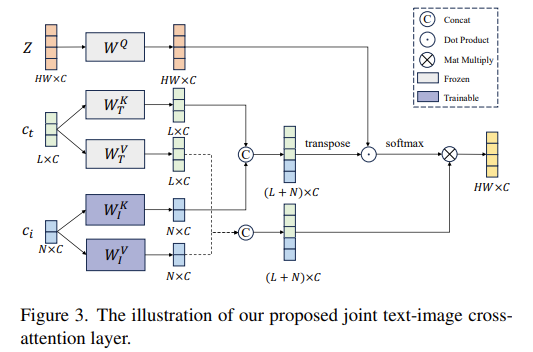

# ViT

[An Image is Worth 16x16 Words: Transformers for Image Recognition at Scale](https://arxiv.org/pdf/2010.11929)

# DiffiT

[DiffiT : Diffusion V ision Transformers for Image Generation](https://arxiv.org/pdf/2312.02139)

# OminiControl

[***OminiControl: Minimal and Universal Control for Diffusion Transformer***](https://arxiv.org/pdf/2411.15098)

## Why

为什么需要提出OminiControl，Omini解决了哪些现有问题？

在现有工作中，生成高质量图像并且实现精确的用户控制仍然是核心挑战，现有工作仍然存在细粒度控制（fine-grained control）问题，并且缺乏生成指定控制的确切空间细节和视觉属性的能力。

虽然已有工作尝试克服这一局限性，但是仍存在以下问题：

1. 现有方法需要大幅度修改结构，或导入特殊模块，造成显著参数开销
2. 现有方法只能单独解决空间对齐（spatially aligned）任务或者非空间对齐任务，无法同时处理两者
   - 空间对齐任务：ControlNet、T2I-Adapter、UniControl
   - 非空间对齐（主题驱动）任务：IP-Adapter、 SSR-Encoder
3. 当前方法主要是基于Unet，但是Dit的生成能力更强

## Methods

1. **Leveraging existing architecture**

   利用现有架构，复用DiT中的VAE编码器，将conditioning image投影到与noisy image相同的latent space中，没有引入额外的模块，降低架构复杂性。

2. **Unified sequence processing**

   统一序列处理，直接将 condition tokens 与 noisy image tokens 拼接在一起，并通过多模态注意力（multi-modal attention）进行处理。实现了各个 tokens 之间的灵活交互，允许tokens之间直接建立关系，而不施加刚性的空间约束。相比于直接的 image condition 相加到noisy image，提高了空间的灵活性。
   
3. **Position-aware token interaction**

   位置感知的token交互。在Flux中的RoPE为每个token分配位置索引，用于保持位置信息。Omini根据控制任务的不同为空间对齐和非对齐任务的condition image tokens $C_I$ 分配不同的位置索引，提出了一种动态定位策略：

   

   对于空间对齐任务，condition tokens与noisy image tokens共享位置信息，以实现空间对齐。对于非空间对齐任务，将 condition tokens 通过 $\triangle$ 进行偏移，减少与$X$的空间重叠。并且对于非对齐任务可以得到更快的收敛速度。

4. **Controllable conditioning strength**

   可控条件强度。在多模态注意力计算中引入一个偏置项来实现对于条件的影响强度。其中 $\gamma$ 是强度因子，$B(\gamma)$是偏置矩阵。

   

## Contributions

1. 用非常少的额外参数实现了高效的图像条件注入
2. 通过将条件令牌集成到原始的多模态注意力中，并利用位置嵌入来处理空间对齐和非对齐任务，实现了统一的控制。
3. 开发主题驱动生成任务的高质量数据集Subjects200K

# InstantStyle

[**InstantStyle: Free Lunch towards Style-Preserving in Text-to-Image Generation**](https://arxiv.org/pdf/2404.02733)

## Why

当前工作存在的一些问题：

1. 风格的概念本质上是不确定的，它涵盖了多种元素，如颜色、材质、氛围、设计和结构等。
2. inversion-based methods 容易导致风格退化（style degradation），常常会丢失细节，且耗时较长。
3. dapter-based approaches 通常需要对 reference image 进行精细的权重调整，以平衡风格强度和文本可控性。

## Method

1. **Separating Content from Image**

   使用CLIP的text encoder来提取参考图像的内容特征作为内容表示，使用CLIP的image encoder 来提取参考图像总体特征。用图像特征减去内容文本特征得到风格特征，从而实现风格与内容的解耦。

2. **Injecting into Style Blocks Only**

    up blocks.0.attentions.1 捕捉风格（颜色、材质、氛围），down blocks.2.attentions.1 捕捉空间布局（结构、构图）

   将参考图像特征仅注入到这些 block 中，从而实现风格迁移

## Contribution

1. 有效实现参考图像的风格和内容的解耦，无需微调和精细调整权重，便于与其他基于attention的方法集成
2. 有效解决风格迁移过程中的内容泄露问题，同时保持了风格强度

## Some points of concern

- The goal of style transfer, or stylized image generation, is to apply the specific style from a given reference image or subset to a target content image. The multifaceted attribute of style makes it difficult to collect stylized datasets, represent style accurately, and evaluate the success of the transfer.

  对于风格迁移任务的数据集构建，以及风格迁移的评估问题仍然待解决。InstantStyle这篇论文中，最后的结果分析都是主观的非量化分析，风格迁移的评估问题值得关注。

- 风格迁移问题解决思路的脉络：fine-tuning diffusion models --> tuning-free approaches for stylized image generation

  对于 tuning-free 的风格迁移分为：

  1. Adapter-free：利用self-attention机制、从reference image中提取关键特征
  2. Adapter-based：使用额外的lightweight model提取参考图像特征，通过cross-attention将特征注入到扩散过程中

- Some approaches aim to address this by constructing paired datasets where the same object is represented in multiple styles, facilitating the extraction of disentangled style and content representations.

  数据集构建实现风格解耦的一种思路

- Don’t forget that CLIP’s feature space has good compatibility, and features in the same feature space can be added and subtracted.

#  IP-Adapter

[**IP-Adapter: Text Compatible Image Prompt Adapter for Text-to-Image Diffusion Models**](https://arxiv.org/pdf/2308.06721)

## Why

为什么要提出该工作，当下有哪些问题待解决？

1. T2I diffusion models 需要复杂的 text prompt 来生成理想图像，并且 text prompt 信息量有限

2.  image prompt 可作为新的 prompt 来指导图像生成，但是现有方法直接基于预训练模型进行微调，需要大量的计算资源，并且与其他基础模型、文本提示和结构化控制不兼容。

3. 也有工作通过使用额外结构控制（如用户绘制的草图、深度图、语义分割图等）和简单的 adapter 来进行图像生成。

   具体来说就是把image prompt 通过CLIP image encoder 和一个可训练网络映射到新特征，与文本特征拼接，进而引导图像生成。但是效果不如微调后的模型

## Method

1. **Image Encoder**

   使用CLIP的image encoder提取出image prompt的image embedding，经过一个可训练的投影网络，将image embedding 投影到 image feature，与text feature维度相同。

2. **Decoupled Cross-Attention**

   解耦cross-attention机制，将 text feature 和 image feature 的 cross-attention 分开，在 Unet 中的 cross-attention layer添加一个新的 cross-attention layer，用于插入图像特征

   

   对于text prompt 的cross-attention，其中$Q=ZW_q,K=c_tW_k,V=c_tW_v$

   

   对于image prompt 的 cross-attention，其中$Q=ZW_q,K^{\prime}=c_iW_k^{\prime},V^{\prime}=c_iW_v^{\prime}$

   

3. **Training and Inference**

   

   在推理阶段通过权重因子 $\lambda$ 调整图像条件的权重

## Contribution

1. IP-Adapter适用于现有的 T2I 扩散模型，在参数量非常少的情况下实现了与微调模型相当甚至更好的效果
2. 可复用且灵活，可以与其他的扩散模型集成，可以与其他的adapter兼容
3. image prompt 和 text prompt 兼容，可以实现多模态图像生成

## Defect

对于主题驱动任务难以解决，无法保持 subject 的一致性

# DEADiff

[**DEADiff: An Efficient Stylization Diffusion Model with Disentangled Representations**](https://arxiv.org/pdf/2403.06951)

## Why

现有的 encoder-based 方法在风格迁移时会削弱 T2I models 的文本可控性

## Method

1. **Dual Decoupling Representation Extraction**

    双解耦表征提取。首先是风格表征提取（STRE），选择风格相同但是内容不同的图像对。使用 Q-Former 作为表征过滤器，解耦图像中的风格和内容表征。参考图像特征经过Q-Former处理后输出，结合描述目标图像内容的文本特征输入到Unet中作为条件指导图像生成。接着内容表征提取（SERE）,选择风格不同但是内容相同的图像对。将Q-Former的输入文本替换为"content"以提取内容相关表征，再将Q-Former输出的 query tokens 与目标图像的风格文本提示共同作为去噪U-Net的条件。如图2（a）所示。同时，在整体流程中也会引入 reconstruction 任务，同时使用"style"Q-Former与"content"Q-Former共同处理处理 query tokens，从而确保 Q-Foemer 不会丢失图像信息。

2. **Disentangled Conditioning Mechanism**

   解耦条件注入机制 (DCM)。将语义条件注入空间分辨率较低的粗粒度层，而将风格条件注入空间分辨率较高的细粒度层。设计了 joint text-image crossattention layer 用于实现 Unet 对于图像特征条件的支持

   

   

3.  **Paired Datasets Construction**

   配对数据集构建。对于风格表征学习任务，选择同一提示生成的两张不同图像作为参考与目标（如图2(a)图像对A）；对于内容表征学习任务，选取相同主体词但不同风格词的图像对（如图2(b)）。

## Contribution

1. 提出双解耦表征提取机制，分别获取参考图像的风格与语义表征，从学习任务角度缓解文本与参考图像的语义冲突问题。
2. 设计解耦条件注入机制，使交叉注意力层的不同部分分别负责图像风格/语义表征的注入，从模型结构角度进一步降低语义冲突。
3. 构建两组成对数据集，通过 non-reconstruction 训练范式支撑 DDRE 机制的有效实现。

## Some points of concern 

- T2I-Adapter-Style and IP-Adapter use Transformer as the image encoder with CLIP image embeddings as input, and utilize the extracted image features through U-Net cross-attention layer.
- To make the image encoders focus on extracting style features, StyleAdapter and ControlNet-shuffle shuffle the patch or pixel of the reference image and could generate various content with the target style.
- ***Evaluation Metrics.*** In the absence of a precise and suitable metric for assessing style similarity (SS), we propose a more reasonable approach as elaborated in Sec. 6.1. Additionally, we determine the cosine similarity within the CLIP text-image embedding space between the textual prompts and their corresponding synthesized images, indicative of the text alignment capability (TA). We also report the results for the image quality (IQ) of each method. Finally, to eliminate the interference caused by randomness in the objective metric calculation, we conduct a user study to reflect the subjective preference (SP) for the results.

# DiT4Edit

[DiT4Edit: Diffusion Transformer for Image Editing](https://arxiv.org/pdf/2411.03286)

# DiT

[***Scalable Diffusion Models with Transformers***](https://arxiv.org/pdf/2212.09748)

